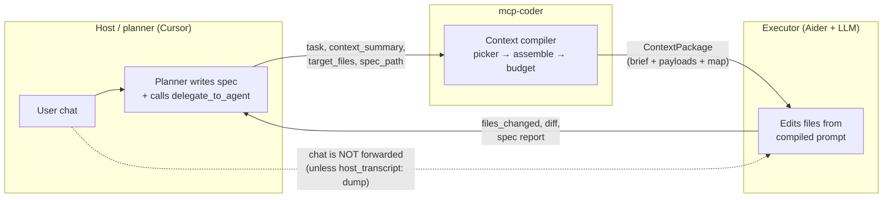
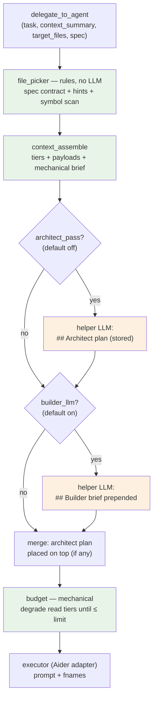
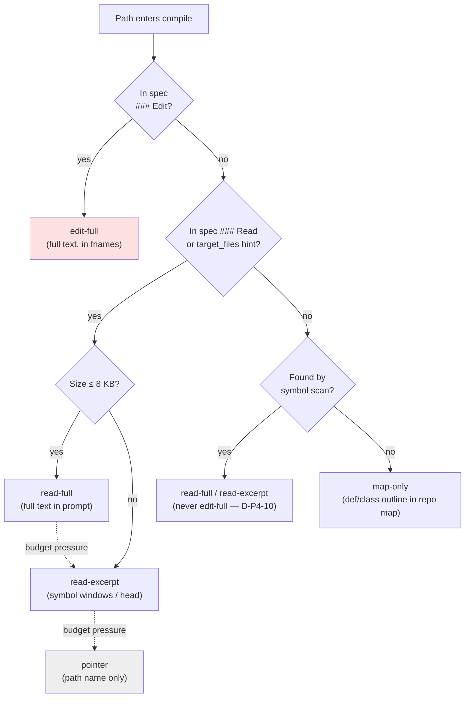
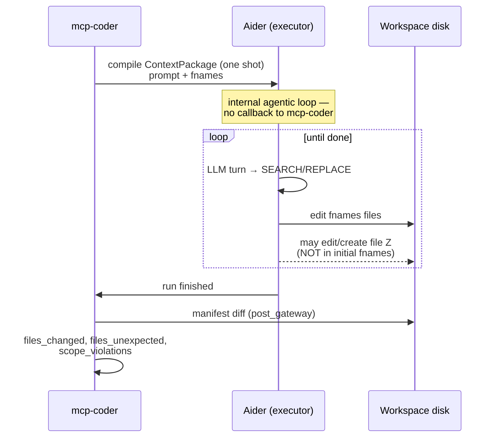
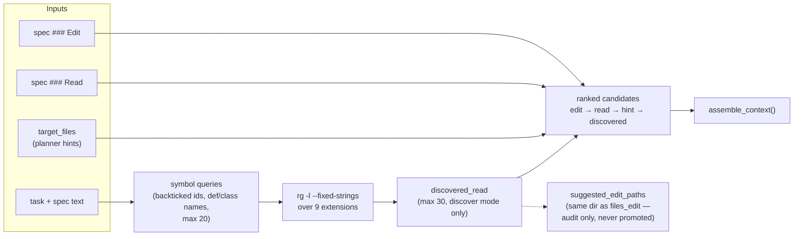
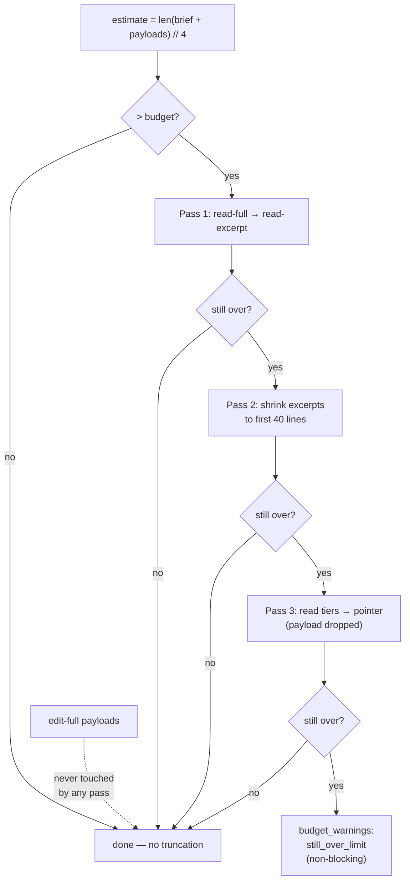
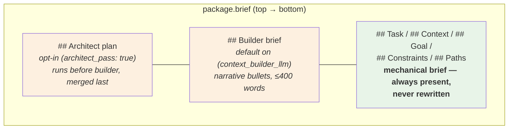

# T-04: Context compiler deep-dive

**Goal:** Understand exactly what the executor (Aider) sees and why. By the end you can run `mcp-coder inspect-context`, read every field, and confidently adjust specs or config when the executor misses context or costs too much.

**Why this matters:** the executor cannot see your Cursor chat. What it gets is a compiled `ContextPackage` — a tiered, budgeted, optionally LLM-enriched prompt. Understanding how it's built is the difference between "why did the executor change the wrong file?" and "I know exactly what I need to fix in the spec."

**Prerequisites:** T-01 (one delegation ran) and T-03 (spec structure).

**Estimated time:** 25–35 min read; +20 min if you run the hands-on demos.

**How to use this tutorial:** it's one of the big ones. First pass: read §1–§3 + the diagrams, skim the rest. Second pass: run the **Try it** demos (they all use the scratch playground from §0 — no API key, no LLM calls, nothing written to your real workspace).

---

## 0. Scratch playground (for all "Try it" demos)

Every demo below runs `inspect-context` against a throwaway workspace — dry-run only, zero API calls. Set it up once:

```bash
DEMO=/tmp/ctx-demo
rm -rf "$DEMO" && mkdir -p "$DEMO/src" "$DEMO/.mcp-coder/specs/tasks"
cd "$DEMO" && git init -q

# Small read dependency (well under the 8 KB excerpt threshold)
cat > src/api.py <<'EOF'
def get_user(user_id: int) -> dict:
    """Fetch a user record."""
    return {"id": user_id, "name": "demo"}
EOF

# Big file (> 8 KB) — will trigger the excerpt engine
python3 - <<'EOF'
lines = [f'def helper_{i}(x):\n    """Helper {i}."""\n    return x + {i}\n' for i in range(200)]
open("src/big_utils.py", "w").write("\n".join(lines))
EOF

# File the symbol scan should discover (mentions get_user, not in spec)
cat > src/consumer.py <<'EOF'
from src.api import get_user

def show(user_id):
    print(get_user(user_id))
EOF

# Edit target (empty for now) + a minimal spec
touch src/cli.py
cat > .mcp-coder/specs/tasks/demo-01-cli.md <<'EOF'
# Demo: add CLI

## Goal
Add an argparse CLI entry point that calls `get_user`.

## Constraints
- argparse only, no extra deps

## Files

### Edit
- src/cli.py

### Read
- src/api.py
- src/big_utils.py
EOF
```

Baseline run (you'll repeat variants of this in later sections):

```bash
mcp-coder inspect-context --workspace "$DEMO" \
  --task 'Add CLI calling `get_user` per spec' \
  --target-files src/cli.py,src/api.py \
  --spec tasks/demo-01-cli.md --pretty
```

---

## 1. The fundamental distinction: prompt ≠ chat history

### Roles (general) vs today's stack (Cursor + Aider)

mcp-coder sits between two **roles**:

| Role | Job today | Implementation today |
|------|-----------|----------------------|
| **Host / planner** | User chat, writes specs, calls `delegate_to_agent` | **Cursor** (via `.cursor/rules/` + MCP) |
| **Executor / backend** | Edits files from a compiled prompt | **Aider** + an LLM provider |

Cursor is **not** the executor. Aider is **not** the planner. The context compiler's job is to turn planner inputs (spec, `task`, `context_summary`, optional host transcript) into what the **executor** sees — regardless of which host/backend you plug in later.



The dashed line is the whole point: the executor never sees your chat by default. Everything it knows arrives through the compiled package.

### What the executor does and does not see

When `delegate_to_agent` runs, the executor (Aider today) does **not** automatically see:

- The full host chat (unless you opt in — see below)
- Prior delegation outputs (except Aider in-process state when the same MCP session reuses a `Coder` instance)
- Helper-LLM internals (builder/architect prompts are separate calls; only their **output** may appear in `package.brief`)

What it **always** gets (with a spec + `context_builder` on) is a compiled `ContextPackage`:

```
package.brief          ←  layered brief (see below)
file payloads          ←  full text or excerpts, injected as fenced read context blocks
repo map               ←  def/class outlines for files not otherwise included
```

**Brief layers** (bottom → top as they appear in `package.brief`):

```
## Task / ## Context / ## Goal / ## Constraints / ## Paths   ←  mechanical brief (always)
---
## Builder brief                                            ←  helper LLM narrative (default on; disable with context_builder_llm: false)
---
## Architect plan                                           ←  helper LLM plan (opt-in; default off; architect_pass: true)
```

**Important:** `architect_pass` runs as a pipeline phase *before* `builder_llm`, but the architect plan is **merged last** — prepended above the builder + mechanical stack (`server/mcp_server.py`).

**Host transcript** (separate from the brief stack):

- Policy default: `host_transcript: none` — executor gets **no** chat dump.
- With `host_transcript: dump`: mcp-coder loads the active **Cursor** chat JSONL (`core/host/cursor.py` → `load_cursor_transcript`) and:
  1. Passes it into **helper LLM** prompts (builder, architect, spec validation) as context.
  2. Prepends it to the **executor** prompt in the Aider adapter (`translate_context_package(..., host_transcript=...)`), *above* `package.brief`.

So with dump enabled, Aider's final prompt order is:

```
[Cursor chat transcript]     ←  only when host_transcript: dump
---
package.brief                ←  architect? + builder? + mechanical
+ read context blocks
+ repo map block
```

The `context_summary` argument on every `delegate_to_agent` call is **always** included in the mechanical brief — it is the planner's guaranteed voice even when `host_transcript: none`.

---

## 2. Pipeline: picker → assemble → architect* → builder* → budget → executor

For `mode=implement` with a valid spec and `context_builder` enabled (default on), phases run in this order:

```
file_picker       rules-based: spec contract + planner hints + symbol scan → ranked candidates
context_assemble  materialize candidates → PathEntry list with tiered payloads + mechanical brief
architect_pass*   helper LLM produces ## Architect plan (stored; merged after builder)
builder_llm*      helper LLM prepends ## Builder brief above mechanical brief
[merge architect plan on top of package.brief if architect succeeded]
budget            trim read-tier payloads until estimated tokens ≤ model budget
executor          Aider adapter: optional Cursor transcript + package.brief + read/map blocks
```



Green = mechanical/deterministic (no LLM). Orange = optional helper-LLM stages, both **non-fatal** on failure.

| Phase | Default | Toggle |
|-------|---------|--------|
| Picker + assemble | **on** | `context_builder: false` |
| Builder LLM | **on** | `context_builder_llm: false` |
| Architect pass | **off** | `architect_pass: true` |
| Host transcript to executor | **off** | `host_transcript: dump` |
| Budget | **on** | `MCP_CODER_CONTEXT_BUDGET_ENABLED=0` |

Without a spec, the picker is **skipped** — only `target_files` go in.

---

## 3. File tiers — the core concept

Every path in the package has a **tier** that determines how much text the executor sees:

| Tier | What Aider sees | When assigned |
|------|-----------------|---------------|
| `edit-full` | Full file text; in Aider's `fnames` (open for editing) | Spec `### Edit` paths |
| `read-full` | Full file text; in prompt as fenced read context block | Spec `### Read` paths; small discovered files |
| `read-excerpt` | Symbol-window extract or head (see §5); fenced block | Read file too large, or demoted by budget |
| `pointer` | Path listed in brief only; no payload | Budget last resort; file unreadable |
| `map-only` | `def`/`class` outline only; in repo map block | Files discovered by picker, not in spec contract |
| `hide` | Not included at all | (Not currently assigned in compile path) |

How a path lands in a tier:



Solid arrows = assemble-time decisions. Dotted = budget degradation (§7). `edit-full` (red) is the only tier that ever enters Aider's editable `fnames`, and budget can never touch it.

**Try it (playground from §0):**

```bash
mcp-coder inspect-context --workspace "$DEMO" \
  --task 'Add CLI calling `get_user` per spec' \
  --target-files src/cli.py,src/api.py,src/big_utils.py \
  --spec tasks/demo-01-cli.md \
  | jq -r '.context_package.entries[] | select(.tier != "map-only") | "\(.tier)\t\(.bytes)\t\(.path)"'
```

Expected output (one line per non-map entry):

```
read-full       110    src/api.py        ← spec ### Read, under 8 KB
read-excerpt    11903  src/big_utils.py  ← spec ### Read, over 8 KB → excerpted
edit-full       0      src/cli.py        ← spec ### Edit (empty file, still full fidelity)
read-full       78     src/consumer.py   ← symbol scan found `get_user` — read, never edit
```

(Note the excerpt is nearly as big as the file: `big_utils.py` is *all* `def` lines, so the ±5-line symbol windows merge into almost everything. Symbol-dense files excerpt poorly — the budget passes in §7 are the backstop.)

**Gotcha worth knowing:** when a **spec** is present, `target_files` hints that are *not* in the spec contract are recorded in `metadata.hint_paths` but **not materialized** as payload entries — the spec contract wins. (Without a spec, all `target_files` become `read-full`.) If the executor must see a file, put it in the spec `### Read`, don't rely on extra `target_files`.

**Critical invariant (D-P4-10, compile time):** discovered files from the symbol scan are **always** `read-full` or `map-only` — **never** `edit-full` in the `ContextPackage`. Only spec `files_edit` (or YAML `files_edit`) become `edit-full` at assemble time. Discovery never promotes a path to `fnames`.

This is **not** a hard runtime lock — see §3.5.

**How Aider translates tiers:**

```python
# core/engine/aider_engine.py — translate_context_package()
fnames = [edit-full paths]                      # Aider opens these for editing
prompt += read_block   # fenced payloads for read-full / read-excerpt entries
prompt += map_block    # def/class outlines for map-only entries
```

So `fnames` = what Aider **starts** with as editable files. Read payloads + repo map = injected into the prompt text.

---

## 3.5 Initial context only — the backend loop can go wider

The `ContextPackage` is **initial context**: it is compiled once, then the executor phase runs. For Aider today that is a single `coder.run(prompt)` call — but **inside** that call Aider runs its own **multi-turn agentic loop** (LLM turns, SEARCH/REPLACE edits, etc.). mcp-coder does **not** re-compile or inject more context between those internal turns (see BL-350 for future supervised loops).

### What “initial” means in practice

| Moment | What is fixed | What can still change |
|--------|----------------|------------------------|
| **Before `executor`** | `package.brief`, read/map payloads, `fnames` | — |
| **During Aider’s loop** | Same prompt text (no mcp-coder refresh) | **Disk** — Aider may edit or create paths **not** in `fnames` |
| **After `executor`** | — | mcp-coder diffs workspace → `files_changed`, `files_unexpected`, `scope_violations` |

So D-P4-10 controls **what we open and emphasize at start**, not “only these bytes may ever change on disk.”

### Can Aider edit file Z mid-loop?

**Often yes**, depending on backend behavior. Our Aider adapter declares:

```python
# core/engine/capabilities.py — AIDER_CAPABILITIES
dynamic_add_files=True      # Aider may pull more files into its edit set
dynamic_create_files=True   # Aider may create new files on disk
shell_default=False         # shell commands off unless MCP_CODER_AIDER_SUGGEST_SHELL=1
```

Headless delegations use `InputOutput(yes=True)` — Aider will not block on interactive “add file to chat?” prompts, but the model can still apply edits Aider accepts. If it touches path Z:

- Z appears in `files_changed` (manifest hash walk after the run)
- If Z ∉ spec contract → `files_unexpected`
- If Z ∉ `files_edit` and `edit_scope: strict` → `scope_violations` (optional auto-revert via post_gateway)
- If `edit_scope: discover` (default) → edits stand; spec report lists unexpected paths for the planner

### What we control today (partial)

| Lever | Effect |
|-------|--------|
| **Spec `### Edit` / `files_edit`** | Only these paths get `edit-full` + `fnames` at start |
| **`edit_scope: strict`** | Post-run revert of edits outside `files_edit` (when snapshots on) |
| **`edit_scope: discover`** | Allow out-of-contract edits; audit only |
| **`MCP_CODER_AIDER_SUGGEST_SHELL=0`** (default) | No shell-command tool path from Aider |
| **Read context in prompt** | Other files visible as read-only text — model may still try to edit them |

We do **not** today expose fine-grained “disable dynamic add/create” flags on the Aider adapter — capability fields are declared for the compiler (`core/engine/capabilities.py`) but runtime tool surface is mostly Aider’s defaults minus shell. Tighter per-tool limits would be backend-specific adapter work (or BL-350 outer loop with re-compile between steps).

### Mental model (one delegation)



**Takeaway:** `inspect-context` shows **starting** conditions. After a delegate, always check `files_changed`, `files_unexpected`, and `scope_violations` in the JSONL response — that is the ground truth for what the loop actually did.

---

## 4. The file picker — how it finds files

`core/context/file_picker.py` — no LLM, no git dependency.

### Step 1: classify inputs

| Source | Paths | Tier |
|--------|-------|------|
| Spec `### Edit` | `files_edit` | `edit-full` |
| Spec `### Read` | `files_read` | `read-full` |
| Planner `target_files` not in spec | `hint_paths` | `read-full` |

Each path is tagged with its source for the audit: `spec_edit`, `spec_read`, `hint`, or `symbol_scan`.

### Step 2: symbol scan (discover mode only)

When `edit_scope: discover` (default):

1. Extract **symbol queries** from `task` + spec text: backtick-quoted identifiers and `def`/`class` names; capped at 20 queries; path-like strings (containing `/`) and stop-words filtered out.
2. Run `rg -l --fixed-strings <symbol>` per query (Python fallback if `rg` unavailable) across `.py`, `.js`, `.ts`, `.tsx`, `.jsx`, `.md`, `.yaml`, `.yml`, `.toml`.
3. New hits (not already in contract/hint set) → `discovered_read`; capped at `MCP_CODER_PICKER_MAX_DISCOVERED` (default **30**).

When `edit_scope: strict`: scanner **skipped**, no `discovered_read`, no `suggested_edit_paths`.

### Step 3: suggested edit paths (audit only)

Discovered paths that sit in the **same directory** as any `files_edit` path → `suggested_edit_paths`. These appear in the MCP response and builder prompt as **audit hints only** — they are **never** promoted to `edit-full` without a spec update (D-P4-10). The planner decides whether to expand the spec.

### Ranked output

```
edit_paths (spec) → read_paths (spec) → hint_paths → discovered_read
```

This is what goes to `assemble_context()`.



**Try it — watch the symbol scan work (playground from §0):**

```bash
# What symbols were extracted, and what did the scan discover?
mcp-coder inspect-context --workspace "$DEMO" \
  --task 'Add CLI calling `get_user` per spec' \
  --target-files src/cli.py \
  --spec tasks/demo-01-cli.md \
  | jq '.context_package.metadata.candidate_files'
```

You should see `symbol_queries` containing `get_user` (backticked in the task **and** in the spec Goal — both are scanned) and `discovered_read` containing `src/consumer.py` — the picker ran `rg -l get_user` and found it. Note `suggested_edit_paths` also lists `src/consumer.py` (same dir as the edit target) — audit hint only, it stays a read tier.

---

## 5. Assembling the package

`core/context/assemble.py — assemble_context()`

For each path in the ranked list:

| File state | Result |
|------------|--------|
| `edit-full` | Read full text → `edit-full` entry with payload |
| `read-full`, file ≤ 8 192 B (`MCP_CODER_READ_FULL_MAX_BYTES`) | Read full text → `read-full` entry |
| `read-full`, file > threshold | Run excerpt engine (see §6) → `read-excerpt` entry |
| File missing | `payload=None`, `bytes=None` entry; logged in `missing_paths` |

Untracked files (git check) are logged in `untracked_paths` (informational; delegate still proceeds).

Then, if the picker ran and `include_repo_map=True`, **repo map entries** are appended for workspace files not already in the ranked set — `def`/`class` outlines only, `tier=map-only`, capped at `MCP_CODER_REPO_MAP_MAX_FILES` (default **150**).

### The mechanical brief

The bottom of the package brief is built from:

```markdown
## Task
<task>

## Context
<context_summary>

## Goal
<spec ## Goal content>

## Constraints
<spec ## Constraints content>

## Paths

- `src/cli.py` — edit-full
- `src/api.py` — read-full
- `core/utils.py` — read-excerpt
```

This brief is **authoritative**. No LLM ever rewrites or removes it. It is the "mechanical brief."

If the picker found `suggested_edit_paths`, they are appended as a note:

```markdown

Suggested edit paths (not in spec contract): `src/helper.py`
```

**Try it — read the actual mechanical brief (playground from §0):**

```bash
mcp-coder inspect-context --workspace "$DEMO" \
  --task 'Add CLI calling `get_user` per spec' \
  --context-summary "api.py is the step-1 API; CLI is new" \
  --target-files src/cli.py,src/api.py \
  --spec tasks/demo-01-cli.md \
  | jq -r '.context_package.brief'
```

You'll see exactly the `## Task / ## Context / ## Goal / ## Constraints / ## Paths` stack above (sections with no content are omitted) — this text goes to the executor verbatim, with helper-LLM layers (if any) stacked on top. Note `src/consumer.py` appears both in `## Paths` and as a suggested-edit note: the symbol scan found it.

---

## 6. Excerpt engine

`core/context/excerpts.py`

Read files over the byte threshold get excerpted instead of included in full.

Two strategies:

| Strategy | When | What you get |
|----------|------|--------------|
| `symbol_windows` | File has `def`/`class` lines | Each symbol line ±5 context lines, merged ranges; header `# excerpt from: path` |
| `head_tail` | No symbols | First 80 lines + `… (excerpt truncated, N bytes total)` |

Excerpts are **materialized to disk** at `.mcp-coder/context/excerpts/<path__as__safe_name>.excerpt.txt`. The path is stored in `entry.excerpt_path` and logged in `context_package.metadata.excerpt_paths`.

**Config:** `MCP_CODER_READ_FULL_MAX_BYTES` (default **8 192** bytes). Files below this threshold → full text even for read tier.

**Try it — see an excerpt get materialized (playground from §0):**

```bash
mcp-coder inspect-context --workspace "$DEMO" \
  --task "Refactor helpers" \
  --target-files src/cli.py,src/big_utils.py > /dev/null

# The excerpt was written to disk:
head -20 "$DEMO/.mcp-coder/context/excerpts/src__big_utils.py.excerpt.txt"
```

You'll see the `# excerpt from: src/big_utils.py` header followed by `def helper_N` windows — the `symbol_windows` strategy. Then shrink the threshold and watch even `src/api.py` get excerpted:

```bash
MCP_CODER_READ_FULL_MAX_BYTES=50 mcp-coder inspect-context --workspace "$DEMO" \
  --task "Refactor helpers" \
  --target-files src/cli.py,src/api.py \
  | jq -r '.context_package.entries[] | "\(.tier)\t\(.path)"'
```

---

## 7. Budget enforcement

`core/context/budget.py — apply_context_budget()`

A token estimate is computed as `len(brief + all_payloads) // 4` (rough ~4 chars/token). If estimated tokens exceed the budget, three degradation passes run **in order until under budget or no more can be done**:

| Pass | What changes |
|------|--------------|
| 1. `read_full_to_excerpt` | `read-full` → `read-excerpt` (run excerpt engine) |
| 2. `excerpt_shrink` | Shrink excerpt to first 40 lines + `… (budget truncated)` |
| 3. `drop_payload` | `read-excerpt`/`read-full` → `pointer` (payload removed; path listed in brief under `## Paths (budget)`) |

**`edit-full` entries are never degraded.** You always see the full content of files you are editing.



If still over budget after all three passes: `metadata.budget_warnings: ["context_budget:still_over_limit"]` (non-blocking; delegation proceeds).

**Try it — force degradation with a tiny budget (playground from §0):**

Two gotchas make a naive `MCP_CODER_CONTEXT_BUDGET_TOKENS=200` prefix silently do nothing: (1) the per-model yaml budget **beats** the env var, so you must also point at a model that isn't in `model_rates.yaml`; (2) the `scripts/mcp-coder` wrapper sources the repo `.env` **after** your prefix vars, clobbering them — bypass with an empty `MCP_CODER_ENV_FILE`.

```bash
touch "$DEMO/empty.env"
MCP_CODER_ENV_FILE="$DEMO/empty.env" AIDER_MODEL=demo/unknown \
MCP_CODER_CONTEXT_BUDGET_TOKENS=200 mcp-coder inspect-context --workspace "$DEMO" \
  --task 'Add CLI calling `get_user` per spec' \
  --target-files src/cli.py,src/api.py,src/big_utils.py \
  --spec tasks/demo-01-cli.md \
  | jq '{tiers: [.context_package.entries[] | select(.tier != "map-only") | {path, tier}], truncations: [.context_package.metadata.truncations[].reason]}'
```

Verified output — all three passes fire, read tiers collapse to `pointer`, and `src/cli.py` stays `edit-full`, untouched:

```json
{
  "tiers": [
    {"path": "src/api.py",       "tier": "pointer"},
    {"path": "src/big_utils.py", "tier": "pointer"},
    {"path": "src/cli.py",       "tier": "edit-full"},
    {"path": "src/consumer.py",  "tier": "read-excerpt"}
  ],
  "truncations": [
    "read_full_max_bytes",
    "context_budget:read_full_to_excerpt",
    "context_budget:read_full_to_excerpt",
    "context_budget:excerpt_shrink",
    "context_budget:excerpt_shrink",
    "context_budget:excerpt_shrink",
    "context_budget:drop_payload",
    "context_budget:drop_payload"
  ]
}
```

Remove the budget override and the `context_budget:*` truncations disappear.

**Budget resolution order:**

1. `MCP_CODER_CONTEXT_BUDGET_ENABLED=0` → disabled
2. Per-model `context_budget_tokens` from `resources/model_rates.yaml`
3. `MCP_CODER_CONTEXT_BUDGET_TOKENS` env var
4. Default **128 000** tokens

Each truncation is logged in `context_package.metadata.truncations`:

```json
[
  {"reason": "context_budget:read_full_to_excerpt", "path": "core/big_file.py", "bytes_dropped": 12400},
  {"reason": "context_budget:drop_payload", "path": "docs/reference.md", "bytes_dropped": 8192}
]
```

---

## 8. Helper LLM layers on the brief (builder + architect)

Two helper LLMs can annotate `package.brief`. Both are **non-fatal** on failure — delegation proceeds with whatever brief was already assembled.

The final brief is a stack — each optional layer sits **above** the one below, never replacing it:



### 8a. Architect pass (opt-in, default off)

`core/context/architect_prompt.py` + `core/engine/architect_pass_llm.py`

When `architect_pass: true` (or `MCP_CODER_ARCHITECT_PASS=1`):

1. Runs **after** `context_assemble`, **before** `builder_llm`.
2. Prompt includes spec summary, mechanical brief paths, picker audit, `task`, `context_summary`, and host transcript (if `host_transcript: dump`).
3. On success, returns a `## Architect plan` block.
4. Plan is **not** merged immediately — it is prepended **after** builder_llm finishes:

```python
# server/mcp_server.py — final merge order
context_package.brief = _merge_architect_plan(architect_plan, context_package.brief)
# architect_plan sits above builder + mechanical brief
```

Use this for harder tasks where you want a structured plan layer before the executor runs. It is separate from `mode=review` (which skips the compile path entirely).

### 8b. Builder LLM (on by default)

`core/context/builder_prompt.py` + `core/engine/context_builder_llm.py`

When `context_builder: true` AND `context_builder_llm: true` (both default **on**):

1. Gathers **builder history** from `workspace_history.db`: up to 5 same-spec delegations + up to 5 project-wide recent delegations (summaries only — `delegation_id`, `outcome`, `created_count`, `modified_count`, `checkpoint_summary`).
2. Assembles a prompt for the builder LLM containing:
   - Preamble (role instructions: narrative bullets only, ≤ 400 words, do not paste code)
   - The mechanical brief
   - Picker audit (ranked paths, discovered reads, symbol queries, path sources)
   - Suggested edit paths (if any)
   - Prior delegation history
   - Host transcript (if `host_transcript: dump` — loaded from Cursor chat JSONL)
   - Planner task + context summary
3. Calls the `context_builder` role model (default: `MCP_CODER_CONTEXT_BUILDER_MODEL`).
4. On success: prepends `## Builder brief\n\n<narrative>\n\n---\n\n` above the mechanical brief. **The mechanical brief is preserved verbatim after the separator.**
5. On failure: logs `builder_llm_error` in `context.metadata`; delegate proceeds with the mechanical brief only. **Non-fatal.**

**Key constraint in builder preamble:** "Do NOT paste file contents, code blocks, or ``` fences. Narrative bullets only." The brief is meant to orient the executor, not duplicate file payloads.

**Result in JSONL:**

```json
"context": {
  "builder_brief_applied": true,
  "builder_brief_applied": false,   // if LLM failed
  "builder_llm_error": "..."         // on failure only
}
```

**History is truncated to fit the builder's token budget** — project-wide rows dropped first, then same-spec rows. Contract (spec paths, mechanical brief) is never truncated.

---

## 9. What the executor actually receives (Aider today)

After all phases, the **Aider adapter** (`translate_context_package()` in `core/engine/aider_engine.py`) converts the package. Another backend would translate tiers differently; this is the current executor mapping.

```
prompt = [host transcript]              # Cursor chat dump, only when host_transcript: dump
       + package.brief                  # architect? + builder? + mechanical
       + read_block                     # fenced payloads for read-full / read-excerpt
       + map_block                      # def/class outlines for map-only entries

fnames = [edit-full paths]              # files Aider opens for editing (not read/map)
```

**Cursor → mcp-coder → Aider flow (concrete):**

1. Cursor planner calls `delegate_to_agent(task=..., context_summary=..., spec_path=...)`.
2. mcp-coder compiles `ContextPackage` (picker, tiers, optional builder/architect).
3. If `host_transcript: dump`, mcp-coder reads the active Cursor session JSONL and prepends it to the Aider prompt.
4. Aider receives `prompt` + `fnames`; its internal LLM runs SEARCH/REPLACE on `fnames` only.

The read context block looks like this in Aider's prompt:

```
---

## Read context (read-only — do not edit unless spec allows)

### `src/api.py` (read-full)
```python
<full file content>
```

### `core/big_file.py` (read-excerpt)
```python
# excerpt from: core/big_file.py

def parse_config(...):
    ...

class Builder:
    ...
```
```

The repo map block:

```
---

## Repo map (symbols only — do not edit unless spec allows)

### `core/utils.py` (map-only)
def helper(x):
class Cache:
```

**Pointer entries** (budget dropped) appear only as path names in the brief under `## Paths (budget)` — no payload, no block.

**Try it — the executor's-eye view (playground from §0):**

```bash
mcp-coder inspect-context --workspace "$DEMO" \
  --task 'Add CLI calling `get_user` per spec' \
  --target-files src/cli.py,src/api.py \
  --spec tasks/demo-01-cli.md \
  | jq '.adapter_preview'
```

`fnames` is what Aider opens for editing; `read_paths_in_prompt` are the fenced blocks; `prompt_tokens_est` is your cost preview before any real delegate.

---

## 10. `inspect-context` — dry-run without a backend call

The single most useful debugging tool. No LLM call, no file edits, no JSONL log.

```bash
# Basic — just target_files
mcp-coder inspect-context \
  --task "Add a config loader that reads .mcp-coder/config.yaml" \
  --target-files core/config/loader.py \
  --context-summary "New module; no existing loader yet"

# With spec (mirrors the real delegate call exactly)
mcp-coder inspect-context \
  --task "Implement CLI per spec" \
  --target-files src/cli.py,src/api.py \
  --context-summary "argparse CLI; api.py from step 1" \
  --spec tasks/my-feature-02-cli.md

# Pretty-print
mcp-coder inspect-context --task "..." --target-files foo.py --pretty

# Include file payloads in output (can be large)
mcp-coder inspect-context --task "..." --target-files foo.py --include-payloads
```

**Builder LLM is skipped by default in inspect** (to avoid surprise API calls). Enable with:

```bash
MCP_CODER_INSPECT_RUN_BUILDER_LLM=1 mcp-coder inspect-context ...
```

### Output structure

```json
{
  "ok": true,
  "compiler_version": "0.3.0",
  "context_package": {
    "brief": "## Task\n...\n## Paths\n...",
    "entries": [
      {"path": "src/cli.py", "tier": "edit-full", "bytes": 1234, "excerpt_path": null},
      {"path": "src/api.py", "tier": "read-full",  "bytes": 800,  "excerpt_path": null},
      {"path": "core/utils.py", "tier": "read-excerpt", "bytes": 600, "excerpt_path": ".mcp-coder/context/excerpts/core__utils.py.excerpt.txt"}
    ],
    "metadata": {
      "bytes_by_tier": {"edit-full": 1234, "read-full": 800, "read-excerpt": 600},
      "token_estimate_preflight": 2158,
      "missing_paths": [],
      "untracked_paths": [],
      "excerpt_paths": [".mcp-coder/context/excerpts/..."],
      "truncations": [],
      "candidate_files": {
        "ranked_paths": ["src/cli.py", "src/api.py"],
        "discovered_read": ["core/utils.py"],
        "suggested_edit_paths": [],
        "symbol_queries": ["Config", "parse_args"]
      },
      "repo_map_count": 42,
      "context_builder_enabled": true
    }
  },
  "auto_merged_read_paths": ["src/api.py"],
  "adapter_preview": {
    "fnames": ["src/cli.py"],
    "read_paths_in_prompt": ["src/api.py", "core/utils.py"],
    "prompt_chars": 8241,
    "prompt_tokens_est": 2060,
    "prompt_hash": "abc123..."
  }
}
```

### Key fields to check

| Field | What it tells you |
|-------|-------------------|
| `entries[].tier` | What fidelity each file has |
| `entries[].bytes` | Payload size after excerpting/truncation |
| `adapter_preview.fnames` | Exactly what Aider will open for editing |
| `adapter_preview.read_paths_in_prompt` | Read payloads injected as fenced blocks |
| `adapter_preview.prompt_tokens_est` | Estimated total token cost |
| `metadata.truncations` | What got cut and why |
| `metadata.budget_warnings` | "still_over_limit" if budget enforcement couldn't fit |
| `metadata.candidate_files.discovered_read` | Files the symbol scan found |
| `metadata.candidate_files.suggested_edit_paths` | Discovered files in edit dirs (audit only) |
| `metadata.candidate_files.symbol_queries` | Symbols extracted from task + spec |
| `metadata.missing_paths` | Spec/hint paths that don't exist on disk yet |
| `auto_merged_read_paths` | Spec Read paths the system appended (see T-03 §5) |
| `contract_warnings` | Spec edit paths missing from `target_files` |

---

## 11. What shows in JSONL after a real delegate

In the `context` block of the delegation record:

```json
"context": {
  "context_package": {
    "compiler_version": "0.3.0",
    "entries": [
      {"path": "src/cli.py", "tier": "edit-full",   "bytes": 1234, "excerpt_path": null},
      {"path": "src/api.py", "tier": "read-full",   "bytes": 800,  "excerpt_path": null}
    ],
    "token_estimate_preflight": 2060,
    "excerpt_paths": [],
    "truncations": []
  },
  "builder_brief_applied": true,
  "context_builder_enabled": true,
  "adapter_in": {
    "fnames": ["src/cli.py"],
    "read_paths_in_prompt": ["src/api.py"]
  }
}
```

**Payloads are not stored in JSONL** — `entries` has path/tier/bytes/excerpt_path only. The actual content that went to Aider is not logged to disk (the package is assembled fresh on each delegate). Use `inspect-context` to reconstruct it.

---

## 12. Config flags

Precedence everywhere: **default → env → `.mcp-coder/config.yaml`** (yaml wins).

| Flag | Default | Effect |
|------|---------|--------|
| `context_builder` | **on** | Picker + assemble runs; without it only `target_files` are used |
| `context_builder_llm` | **on** | Builder LLM narrative brief; requires `context_builder` on |
| `MCP_CODER_READ_FULL_MAX_BYTES` | **8 192** | Byte threshold before excerpting read files |
| `MCP_CODER_PICKER_MAX_DISCOVERED` | **30** | Cap on symbol-scan discovered files |
| `MCP_CODER_REPO_MAP_MAX_FILES` | **150** | Cap on map-only repo map entries |
| `MCP_CODER_CONTEXT_BUDGET_TOKENS` | **128 000** | Token budget (per-model yaml overrides) |
| `MCP_CODER_CONTEXT_BUDGET_ENABLED` | **1** | Set to `0` to disable budget enforcement |
| `MCP_CODER_CONTEXT_BUILDER_LLM` | `1` | Env toggle for builder LLM |
| `MCP_CODER_INSPECT_RUN_BUILDER_LLM` | `0` | Enable builder LLM in inspect CLI |
| `host_transcript` | **none** | `dump` → load Cursor chat JSONL into helper LLMs + executor prompt |
| `architect_pass` | **off** | `true` → `## Architect plan` above builder + mechanical brief |

Turn the context builder off to fall back to the Phase 1/2 path (only `target_files`, no picker, no map):

```yaml
# .mcp-coder/config.yaml
context_builder: false
```

Turn the builder LLM narrative off but keep the picker:

```yaml
context_builder_llm: false
```

---

## 13. Invariants (locked design decisions)

These are locked in the code (not just conventions):

| Invariant | Where | Meaning |
|-----------|-------|---------|
| **D-P4-10** | `file_picker.py`, `assemble.py` | At **compile time**, discovery never grants `edit-full`; only `files_edit` → `fnames`. Runtime edits outside that set are handled by post_gateway (§3.5). |
| Mechanical brief is never rewritten | `builder_prompt.py` | Builder adds narrative **above** a separator; mechanical brief follows verbatim. |
| Budget never degrades `edit-full` | `budget.py` | Edit target content is always delivered in full. |
| Builder/architect failure is non-fatal | `mcp_server.py` | LLM errors in optional stages are logged but pipeline continues. |
| `inspect-context` skips builder LLM by default | `inspect.py` | Dry-run should not make API calls unless explicitly requested. |

---

## 14. Common debugging scenarios

**"The executor edited the wrong file"**

```bash
mcp-coder inspect-context --spec tasks/my-spec.md --task "..." --target-files ...
```

Check `adapter_preview.fnames` — that's the **initial** edit set. If an unexpected file was **changed on disk** after the run, it may have been touched mid-loop even though it wasn't in `fnames` (§3.5) — check `files_changed` / `files_unexpected` in JSONL. If an unexpected file is in `fnames` at inspect time, it's in spec `files_edit`. If the right file is missing from context, add it to spec `### Read` or `target_files`.

**"The executor didn't know about a key API from step 1"**

Check `context_package.entries` for `src/api.py` — is it there? What tier? If missing: add it to spec `### Read` or `target_files`. If `tier=pointer`: budget dropped the payload — enlarge budget or shrink other read files.

**"The executor keeps editing files outside the spec"**

This can happen **mid-loop** even when `inspect-context` showed a tight `fnames` list (§3.5). With `edit_scope: strict`, out-of-contract edits → `scope_violations` and optional revert. With `discover`, edits stand but land in `files_unexpected` on the spec report. Fix: add paths to spec `### Edit`, or use strict + expand contract before re-delegate. Check `suggested_edit_paths` in inspect output for symbol-scan candidates.

**"Token estimate is higher than expected"**

Check `metadata.bytes_by_tier` — which tier is dominating? Check `metadata.repo_map_count` — 150 symbol outlines add up. Lower `MCP_CODER_REPO_MAP_MAX_FILES` or set `context_builder: false` for a quick test.

**"I want to see what the builder LLM would say"**

```bash
MCP_CODER_INSPECT_RUN_BUILDER_LLM=1 mcp-coder inspect-context --spec tasks/my-spec.md --task "..." --target-files ... --pretty
```

Check `context_package.brief` for the `## Builder brief` section.

---

## 15. Code map

| Concern | Module |
|---------|--------|
| Tiers, `ContextPackage`, `PathEntry` | `core/context/package.py` |
| File picker (symbol scan, ranking) | `core/context/file_picker.py` |
| Assemble + tier assignment | `core/context/assemble.py` |
| Excerpt engine | `core/context/excerpts.py` |
| Repo map (map-only entries) | `core/context/repo_map.py` |
| Budget enforcement | `core/context/budget.py` |
| Builder LLM prompt | `core/context/builder_prompt.py` |
| Builder history (from workspace_history.db) | `core/context/builder_history.py` |
| Adapter translation (fnames, read block) | `core/engine/aider_engine.py` → `translate_context_package()` |
| Backend capabilities (dynamic add/create, shell) | `core/engine/capabilities.py` |
| Post-run scope audit / revert | `core/workspace/gateway.py`, `core/workspace/snapshot.py` |
| Dry-run inspect | `core/context/inspect.py` |
| CLI entry point | `core/cli/inspect_context.py` |
| Config flags | `core/config/context_builder.py`, `core/config/auto_merge.py` |

---

## Next

- **T-05 (Workspace history & RAG):** `workspace_history.db`, `list_delegations`, `get_delegation_diff` — what the history layer stores and how the builder history is populated
- **T-06 (Phase 4 pipeline):** full `delegation_pipeline` JSONL; flag matrix; all optional phases wired together
- **BL-335:** token counts in `model_roles` currently `null` for several paths — context builder included; understanding this gap requires T-04 context
