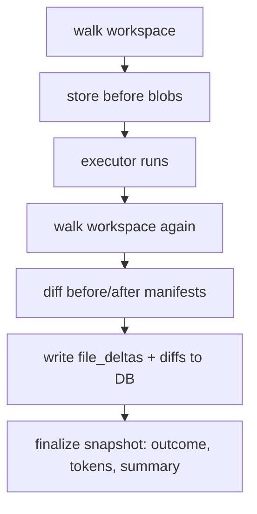

# T-05: Workspace history & delegation RAG

**Goal:** Understand what mcp-coder remembers across delegations — where it's stored, how to query it with MCP tools, and what "delegation RAG" means today vs what's planned for Phase 5.

**Why this matters:** The context builder (T-04) pulls delegation history to write a smarter brief. `files_changed` comes from a manifest diff, not git. Every MCP tool that takes a `delegation_id` reads from this layer.

**Prerequisites:** T-01 (at least one delegation ran), T-02 (JSONL records), T-04 (context compiler).

**Estimated time:** 15–20 min.

---

## 1. Two databases, one project key

After your first delegation runs, two SQLite databases appear under `~/.mcp-coder/projects/<key>/`:

```
~/.mcp-coder/
  projects/
    <sha256 of workspace abs-path>/
      workspace_history.db    ← delegation checkpoints + file diffs + blobs
      delegation_rag.db       ← FTS5 full-text search index of past delegations
      project.json
      sessions/
        <mcp_session_id>/
          delegations.jsonl
```

The key is a **SHA-256 of the absolute workspace path** — so `~/work/myapp` and `/Users/alice/work/myapp` get different keys even on the same machine. This keeps per-workspace history fully isolated.

```python
# core/storage/paths.py
def project_key(workspace) -> str:
    return sha256_hex(normalize_workspace(workspace))   # stable, collision-free

def workspace_history_db_path(workspace) -> Path:
    return project_dir(workspace) / "workspace_history.db"

def delegation_rag_db_path(workspace) -> Path:
    return project_dir(workspace) / "delegation_rag.db"
```

Both databases are **not** inside the workspace repo — they live in `~/.mcp-coder/` so they never pollute git.

---

## 2. `workspace_history.db` — what gets recorded

The history database has three tables:

| Table | What it holds |
|-------|--------------|
| `snapshots` | One row per delegation: id, timestamps, spec_path, outcome, model, duration, token count, checkpoint summary, delta counts |
| `file_deltas` | Per-file: path, change_type (`created`/`modified`/`deleted`), content hash, unified diff text |
| `blobs` | File contents stored by SHA-256 hash (before and after the delegate) |

### How a checkpoint is written

On every `delegate_to_agent` call:



1. **Before** the executor: `walk_workspace()` hashes every non-binary file (path → SHA-256 + size + mtime). This is the "before manifest."
2. File blobs for spec contract paths are stored in `blobs` so diffs can be computed.
3. **After** the executor finishes: walk again → compare → write `file_deltas` rows with unified diffs.
4. `finalize_checkpoint_metadata()` patches the snapshot row with outcome, model, token count, and a `checkpoint_summary`.

**`checkpoint_summary`** is a one-sentence LLM-generated label (from `core/workspace/checkpoint_summary.py`) — it becomes the human-readable description of what a delegation did.

### The manifest walk is git-agnostic

`walk_workspace()` walks the filesystem directly (not `git diff`). Git is used as a **secondary signal** only when the manifest walk isn't available:

| Condition | `files_changed` source |
|-----------|------------------------|
| Snapshot enabled (default) | Manifest diff (`attribution_source: manifest`) |
| `MCP_CODER_DISABLE_WORKSPACE_SNAPSHOT=1` | git dirty + mtime fallback |

This means `files_changed` is reliable even in repos with no git, dirty state, or untracked files.

---

## 3. The five MCP tools that read history

All five tools accept `workspace_path` (defaults to the server's workspace).

### `list_delegations`

The project timeline — most useful for "what has happened recently?"

```
list_delegations(limit=20, spec_path=None, file_path=None)
```

Returns a list of checkpoint rows, newest first:

```json
{
  "found": true,
  "delegations": [
    {
      "delegation_id": "abc-123",
      "timestamp_end": "2026-06-10T18:45:00Z",
      "spec_path": "tasks/my-feature-02-cli.md",
      "checkpoint_summary": "Added argparse CLI entry point calling get_user()",
      "outcome": "success",
      "model": "gemini/gemini-2.0-flash",
      "duration_ms": 12400,
      "tokens_total": 8200,
      "created_count": 1,
      "modified_count": 2,
      "deleted_count": 0
    }
  ]
}
```

**Useful filters:**
- `spec_path="tasks/my-feature-02-cli.md"` → all attempts on one spec (retry history)
- `file_path="src/cli.py"` → every delegation that touched a specific file

### `get_checkpoint_detail`

Metadata + path lists without diff bodies — lightweight "what did this delegation touch?"

```
get_checkpoint_detail(delegation_id="abc-123")
get_checkpoint_detail(latest=true)   ← most recent checkpoint
```

```json
{
  "found": true,
  "checkpoint": {
    "delegation_id": "abc-123",
    "checkpoint_summary": "Added argparse CLI...",
    "outcome": "success",
    "model": "gemini/gemini-2.0-flash",
    "duration_ms": 12400,
    "tokens_total": 8200,
    "created": ["src/cli.py"],
    "modified": ["src/api.py"],
    "deleted": []
  }
}
```

### `get_delegation_diff`

Full unified diffs for a checkpoint — what lines changed?

```
get_delegation_diff(delegation_id="abc-123")
get_delegation_diff(latest=true)
get_delegation_diff(delegation_id="abc-123", file_path="src/api.py")  ← one file only
```

```json
{
  "found": true,
  "delegation_diff": {
    "delegation_id": "abc-123",
    "created": ["src/cli.py"],
    "modified": ["src/api.py"],
    "deleted": [],
    "diffs": {
      "src/api.py": "@@ -1,3 +1,5 @@\n def get_user(...):\n+    ...\n"
    },
    "diff_truncated": false
  }
}
```

**Size limits:** diffs are truncated at 8 000 chars/file and 32 000 chars total (configurable via `MCP_CODER_DIFF_MAX_CHARS_PER_FILE` / `MCP_CODER_DIFF_MAX_TOTAL_CHARS`). `diff_truncated: true` signals when truncation occurred.

### `get_file_history`

Per-file timeline: "who touched this file across all delegations?"

```
get_file_history(file_path="src/api.py", limit=10)
```

```json
{
  "found": true,
  "file_path": "src/api.py",
  "changes": [
    {
      "delegation_id": "abc-123",
      "checkpoint_summary": "Added get_user endpoint",
      "change_type": "created",
      "timestamp_end": "2026-06-09T14:00:00Z",
      "diff": "@@ -0,0 +1,4 @@\n+def get_user(...):\n..."
    }
  ]
}
```

### `rag_search`

Full-text keyword search across all past delegations:

```
rag_search(query="argparse CLI", limit=5)
rag_search(query="failing tests", outcome="failure")
rag_search(query="api endpoint", spec_path_prefix="tasks/my-feature")
```

Returns ranked hits with `delegation_id` you can feed into `get_delegation_diff` or `get_checkpoint_detail`:

```json
{
  "found": true,
  "query": "argparse CLI",
  "hits": [
    {
      "delegation_id": "abc-123",
      "score": 3.4,
      "checkpoint_summary": "Added argparse CLI entry point...",
      "outcome": "success",
      "files_changed": ["src/cli.py", "src/api.py"]
    }
  ]
}
```

---

## 4. The RAG index — what it is and where the gap is

### What `delegation_rag.db` contains

After each delegation, mcp-coder indexes a row into `delegation_rag.db`:

| Field in `searchable_text` | Source |
|---------------------------|--------|
| `checkpoint_summary` | LLM one-liner of what the delegate did |
| `task_preview` | First 500 chars of the `task` argument (secrets redacted) |
| `spec_path` | Path of the spec used |
| `files_changed` | CSV of changed paths |
| `outcome` | `success` / `failure` / `partial` |

Search is SQLite **FTS5 BM25** with a recency boost (newer delegations rank higher for equal BM25 score).

### What `rag_search` does NOT do

- No semantic / vector search — text match only (OR of terms ≥ 2 chars)
- No document retrieval — hits return summaries, not file content
- Not integrated into the context compile path today

### The gap: RAG is wired but not used in pipeline

```
Phase 3 shipped:          delegation_rag.db, rag_search MCP tool, index on every delegate
Phase 5 plans:            feed rag_search results into picker/builder as read hints (BL-002)
Today:                    rag_search is callable by the Cursor planner; mcp-coder compile
                          path does NOT call it internally on every delegate
```

The `rag_search` tool exists for the **planner** (Cursor agent) to query: "have we done something like this before?" Then the planner can pull that `delegation_id` into `context_summary` or add relevant files to `target_files`. mcp-coder itself doesn't auto-inject RAG hits into the context compile (that's Phase 5 — BL-002, BL-348).

---

## 5. How history feeds the context builder (T-04 §8b)

Even though RAG isn't in the compile path, `workspace_history.db` **is** — through the builder LLM:

```python
# core/context/builder_history.py — gather_builder_history()
same_spec:       list_delegations(workspace, spec_path=spec_rel, limit=5)
project_recent:  list_delegations(workspace, limit=5)  # excluding same_spec ids
```

The builder prompt receives:
- Up to **5 prior attempts on the same spec** (summaries: id, outcome, checkpoint_summary, delta counts)
- Up to **5 recent project-wide delegations** (same fields)

This is how the builder brief knows "step 1 created api.py" or "previous attempt failed — modified cli.py but tests didn't pass." No diff body, no file content — only the summary row. The full diff is available via `get_delegation_diff` but is too large for every builder call (BL-348/350 would push richer context later).

---

## 6. Schema quick reference

### `workspace_history.db` — `snapshots` table

| Column | Type | Notes |
|--------|------|-------|
| `delegation_id` | TEXT PK | UUID from `delegate_to_agent` |
| `mcp_session_id` | TEXT | Session that ran this delegation |
| `timestamp_start` / `timestamp_end` | TEXT | ISO-8601 UTC |
| `spec_path` | TEXT | Relative spec path (nullable) |
| `workspace_path` | TEXT | Abs path of workspace |
| `checkpoint_summary` | TEXT | LLM one-liner |
| `outcome` | TEXT | `success` / `failure` / `partial` |
| `model` | TEXT | Model used for executor |
| `duration_ms` | INTEGER | Wall time |
| `tokens_total` | INTEGER | LiteLLM total (often null — BL-335) |
| `delta_created` / `modified` / `deleted` | INTEGER | File count by type |

### `workspace_history.db` — `file_deltas` table

| Column | Type | Notes |
|--------|------|-------|
| `delegation_id` | TEXT FK | |
| `path` | TEXT | Repo-relative path |
| `change_type` | TEXT | `created` / `modified` / `deleted` |
| `content_hash` | TEXT | SHA-256 of after content (null for deleted) |
| `prev_hash` | TEXT | SHA-256 of before content (null for created) |
| `is_binary` | INTEGER | 0/1 |
| `diff` | TEXT | Unified diff (modified text files only; null otherwise) |

---

## 7. Config flags

| Flag | Default | Effect |
|------|---------|--------|
| `MCP_CODER_DISABLE_WORKSPACE_SNAPSHOT` | `0` | Set to `1` to disable manifest walk + DB recording entirely |
| `MCP_CODER_RAG_ENABLED` | `1` (true) | Set to `0` to disable RAG indexing (`delegation_rag.db` not updated) |
| `rag_enabled` in `.mcp-coder/config.yaml` | `true` | Workspace-level override (beats env) |
| `MCP_CODER_DIFF_MAX_CHARS_PER_FILE` | `8000` | Truncation limit per file in diff responses |
| `MCP_CODER_DIFF_MAX_TOTAL_CHARS` | `32000` | Total truncation limit across all files in diff response |
| `MCP_CODER_BUILDER_HISTORY_SPEC_LIMIT` | `5` | Max same-spec rows fed to builder LLM |
| `MCP_CODER_BUILDER_HISTORY_PROJECT_LIMIT` | `5` | Max project-wide rows fed to builder LLM |
| `snapshot_retention` in config | `session` | Cleanup policy (stub — no purge yet; BL-320b) |

---

## 8. Common patterns

**"Show me what happened in the last few delegates"**

```
list_delegations(limit=10)
```

**"How many times have we retried this spec, and did any succeed?"**

```
list_delegations(spec_path="tasks/my-feature-02-cli.md")
```

**"What exactly changed in the most recent delegation?"**

```
get_delegation_diff(latest=true)
```

**"Who touched this file across the whole project?"**

```
get_file_history(file_path="src/api.py")
```

**"Have we done something similar before?"**

```
rag_search(query="argparse CLI entry point", limit=5)
# then:
get_checkpoint_detail(delegation_id="<hit.delegation_id>")
```

**"I want to see the diff for a delegation I ran three days ago"**

```
list_delegations(limit=50)   ← find the delegation_id
get_delegation_diff(delegation_id="...")
```

---

## 9. Code map

| Concern | Module |
|---------|--------|
| SQLite schema + low-level read/write | `core/workspace/history_db.py` |
| MCP-safe query functions | `core/workspace/history_query.py` |
| Manifest walk (git-agnostic hash scan) | `core/workspace/walk.py`, `manifest.py` |
| Begin/commit snapshot around executor | `core/workspace/snapshot.py` |
| Builder history (feeds T-04 §8b) | `core/context/builder_history.py` |
| Checkpoint summary LLM | `core/workspace/checkpoint_summary.py` |
| RAG DB schema + upsert | `core/rag/db.py` |
| RAG indexing (called after each delegate) | `core/rag/index.py` |
| FTS5 search + recency scoring | `core/rag/search.py` |
| RAG enabled flag | `core/config/rag.py` |
| Storage paths (project key, DB locations) | `core/storage/paths.py` |

---

## Next

- **T-06 (Delegation pipeline):** all 10 phases of `delegate_to_agent` in one JSONL record; which phases produce which history rows; config flag matrix
- **T-07 (End-to-end trace):** pick a real `delegation_id`; trace JSONL → checkpoint detail → diff → spec report
- **BL-002 / Phase 5:** wire `rag_search` into the picker/builder so past delegation hits auto-surface relevant read paths
