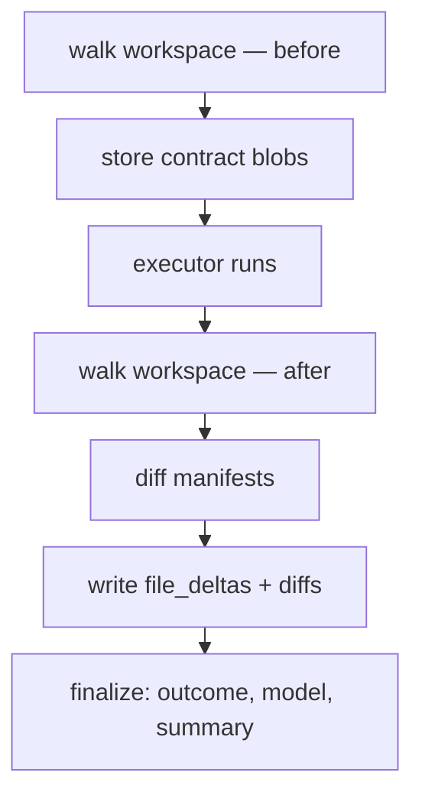

# T-05: Workspace history

**Goal:** Understand why mcp-coder keeps its own delegation checkpoints, what value that adds over git alone, and how to browse, diff, and revert them — mostly via the **`mcp-coder history` CLI**.

**Why this matters:** Every `delegate_to_agent` call can leave a checkpoint: what changed, unified diffs, outcome, model, duration. That layer powers `files_changed` today, feeds the context builder (T-04), enables revert to a last-known-good state, and is the foundation for stricter policies and trajectory analysis later.

**Prerequisites:** T-01 (at least one delegation ran), T-02 (JSONL records). T-04 helps for the builder-history link.

**Estimated time:** 15–20 min.

---

## 1. Why workspace history (not just git)?

Git answers: *"what changed in the repo since the last commit?"*

Workspace history answers: *"what did **this AI delegation** change, with what task/spec/model/outcome, regardless of git state?"*

| Question | Git | `workspace_history.db` |
|----------|-----|------------------------|
| What changed in delegation `abc-123`? | Only if you committed before/after | **Yes** — per-delegation delta + stored diffs |
| Works with no git / dirty / untracked files? | Weak | **Yes** — manifest hash walk |
| Which spec + task + model produced this edit? | No | **Yes** — snapshot metadata |
| Revert **one delegate's** edits without touching other work? | Hard (reset/revert commits) | **`mcp-coder history revert`** — blob-backed |
| Audit "was this file change expected per spec?" | Manual | **Building block** — contract paths vs `file_deltas` (post_gateway today; richer policy later) |

Git stays the source of truth for **your** commits. Workspace history is the source of truth for **agent boundaries** — one row per `delegate_to_agent`, aligned with MCP session + spec + JSONL (T-02).

---

## 2. What we use it for (today and next)

Workspace history is **not** only context-builder fuel. It is the per-delegation truth layer for:

| Use | Today | Later (Phase 5+) |
|-----|-------|------------------|
| **`files_changed` / `files_unexpected`** | Manifest diff after each delegate | Same; primary attribution |
| **Context builder** (T-04 §8b) | Last 5 same-spec + 5 project summaries in builder prompt | Richer hints (BL-348/349) |
| **Scope / policy enforcement** | `edit_scope: strict` → `scope_violations` + auto-revert via stored blobs (post_gateway) | Stronger "expected vs actual" gates (BL-349, gatekeeping ideas) |
| **Revert to working checkpoint** | `mcp-coder history revert <id>` restores pre-delegate file content from blobs | Planner-guided "roll back step 2, keep step 1" |
| **Audit & debugging** | CLI/MCP: list, diff, per-file timeline | T-07 end-to-end trace |
| **AI trajectory metadata** | Outcome, model, duration, tokens, checkpoint summary, spec path per row | Export/analysis, eval sets, possible training corpora (design TBD) |

The metadata stack (who ran what, when, with which outcome) is stored **whether or not** you use git — useful later for understanding agent trajectories across long projects, not just for the next prompt.

---

## 3. Where it lives

After your first delegation, history is stored under `~/.mcp-coder/projects/<key>/`:

```
~/.mcp-coder/
  projects/
    <sha256 of workspace abs-path>/
      workspace_history.db    ← checkpoints, file_deltas, content blobs
      project.json
      sessions/
        <mcp_session_id>/
          delegations.jsonl   ← full JSONL record (T-02); separate from SQLite
```

The project key is a **SHA-256 of the absolute workspace path** — different paths = different history DBs. Nothing is written inside your git repo.

**Three tables in `workspace_history.db`:**

| Table | Holds |
|-------|--------|
| `snapshots` | One row per delegation: id, timestamps, spec_path, outcome, model, duration, tokens, checkpoint summary, delta counts |
| `file_deltas` | Per path: `created` / `modified` / `deleted`, hashes, unified diff text |
| `blobs` | File bytes keyed by SHA-256 (before/after content for diff + revert) |

### How a checkpoint is written



1. **Before:** `walk_workspace()` builds a manifest (path → content hash). Contract-path blobs go into `blobs`.
2. **After:** second walk → `created` / `modified` / `deleted` → unified diffs for text files.
3. **Finalize:** outcome, model, `checkpoint_summary` (one-line label), token/duration fields.

Default: snapshot **on**. Disable entirely with `MCP_CODER_DISABLE_WORKSPACE_SNAPSHOT=1` (falls back to git/mtime for `files_changed` only — no DB, no revert).

---

## 4. CLI — `mcp-coder history` (start here)

Most inspection work does not need MCP or a running server. From your **workspace root** (or pass `--workspace`):

```bash
# Recent delegations (newest first)
mcp-coder history list

# Filter by spec or file
mcp-coder history list --spec tasks/my-feature-02-cli.md
mcp-coder history list --file src/api.py

# Machine-readable
mcp-coder history list --json | head -3
```

**Example line output:**

```
2026-06-10T18:45:00Z  a1b2c3d4…  +1 ~2 -0  tasks/my-feature-02-cli.md  Added argparse CLI calling get_user()
```

### Show checkpoint metadata (no diff bodies)

```bash
mcp-coder history latest
mcp-coder history show a1b2c3d4-e5f6-7890-abcd-ef1234567890
mcp-coder history show --latest --json
```

**Example text output:**

```
delegation_id: a1b2c3d4-…
summary:       Added argparse CLI calling get_user()
spec:          tasks/my-feature-02-cli.md
outcome:       success  model=gemini/…  duration=12s
changed:       +1 ~2 -0
created:       src/cli.py
modified:      src/api.py, src/main.py
deleted:       (none)
```

### Unified diffs for one delegation

```bash
mcp-coder history diff --latest
mcp-coder history diff a1b2c3d4-… --path src/api.py
mcp-coder history diff --latest --json
```

Diffs truncate at 8 000 chars/file and 32 000 total (`MCP_CODER_DIFF_MAX_CHARS_PER_FILE` / `MCP_CODER_DIFF_MAX_TOTAL_CHARS`). JSON includes `diff_truncated` when capped.

### Per-file timeline across all delegations

```bash
mcp-coder history file src/api.py
mcp-coder history file src/api.py --limit 5 --json
```

Shows which delegations touched the file, change type, and diff snippet when stored.

### Revert to pre-delegation state

Restore disk to **immediately before** that delegation ran (uses blobs in the DB):

```bash
# Revert all paths changed in that delegation
mcp-coder history revert a1b2c3d4-…

# Revert only specific paths
mcp-coder history revert a1b2c3d4-… --paths src/api.py src/cli.py
```

- **Created** during the delegate → file deleted from disk  
- **Modified** → previous content written from `prev_hash` blob  
- **Deleted** during the delegate → file restored from blob  

This is the same primitive **post_gateway** uses when `edit_scope: strict` auto-reverts `scope_violations`. Manual CLI revert is how you recover a last-known-good checkpoint after a bad delegate.

**Workflow — find id then revert:**

```bash
mcp-coder history list --limit 5
mcp-coder history show --latest          # confirm outcome / paths
mcp-coder history diff --latest          # optional: read diffs
mcp-coder history revert <delegation_id> --paths src/broken.py
```

---

## 5. MCP tools (same data, from Cursor)

When the MCP server is connected, the planner can call the same operations (useful in chat; CLI is often faster for you):

| MCP tool | CLI equivalent |
|----------|----------------|
| `list_delegations` | `history list` |
| `get_checkpoint_detail` | `history show` / `history latest` |
| `get_delegation_diff` | `history diff` |
| `get_file_history` | `history file <path>` |

*(No MCP wrapper for `revert` today — use CLI.)*

All accept optional `workspace_path`. `get_delegation_diff` / `get_checkpoint_detail` accept `latest=true` instead of an id.

---

## 6. Context builder link (one consumer among many)

`core/context/builder_history.py` reads the same DB:

- Up to **5** recent delegations on the **same spec** (`list_delegations(spec_path=…)`)
- Up to **5** recent **project-wide** rows (summaries only — no full diffs)

Fields passed to the builder LLM: `delegation_id`, `outcome`, `checkpoint_summary`, delta counts, `delegate_mode`, `timestamp_end`. See T-04 §8b.

This is **best-effort** — if snapshots are disabled or the DB is empty, delegation proceeds with an empty history block.

---

## 7. Schema quick reference

### `snapshots`

| Column | Notes |
|--------|--------|
| `delegation_id` | PK — from `delegate_to_agent` |
| `mcp_session_id` | Cursor/MCP session |
| `timestamp_start` / `timestamp_end` | ISO UTC |
| `spec_path` | Task spec used (nullable) |
| `checkpoint_summary` | One-line label of what happened |
| `outcome` | `success` / `failure` / `partial` |
| `model`, `duration_ms`, `tokens_total` | Trajectory metadata (`tokens_total` often null — BL-335) |
| `delta_created` / `modified` / `deleted` | File counts |

### `file_deltas`

| Column | Notes |
|--------|--------|
| `path` | Repo-relative |
| `change_type` | `created` / `modified` / `deleted` |
| `content_hash` / `prev_hash` | SHA-256 blob refs |
| `diff` | Unified diff (modified text files) |

---

## 8. Config flags

| Flag | Default | Effect |
|------|---------|--------|
| `MCP_CODER_DISABLE_WORKSPACE_SNAPSHOT` | `0` | `1` → no DB, no blobs, no CLI history |
| `MCP_CODER_DIFF_MAX_CHARS_PER_FILE` | `8000` | Per-file diff cap in responses |
| `MCP_CODER_DIFF_MAX_TOTAL_CHARS` | `32000` | Total diff cap |
| `MCP_CODER_BUILDER_HISTORY_SPEC_LIMIT` | `5` | Same-spec rows for builder |
| `MCP_CODER_BUILDER_HISTORY_PROJECT_LIMIT` | `5` | Project-wide rows for builder |
| `snapshot_retention` in config | `session` | Retention policy (stub — no purge yet) |

---

## 9. Delegation search (RAG) — coming soon

Phase 3 shipped a separate `delegation_rag.db` and keyword search over past delegations. **This tutorial does not cover it** — Phase 5 may replace or redesign the approach (BL-002, BL-348). Until then:

- No planner workflow depends on it
- Context compile does **not** call it
- Ignore `mcp-coder rag` / `rag_search` unless you are experimenting

When we document search properly, it will get its own section or tutorial update.

---

## 10. Code map

| Concern | Module |
|---------|--------|
| SQLite schema + blobs | `core/workspace/history_db.py` |
| Query + MCP wrappers | `core/workspace/history_query.py` |
| Manifest walk | `core/workspace/walk.py`, `manifest.py` |
| Begin/commit around executor | `core/workspace/snapshot.py` |
| Revert from blobs | `core/workspace/revert.py` |
| Strict scope auto-revert | `core/workspace/gateway.py` |
| Builder history | `core/context/builder_history.py` |
| Checkpoint summary | `core/workspace/checkpoint_summary.py` |
| **CLI** | `core/cli/history.py` → `mcp-coder history` |
| Storage paths | `core/storage/paths.py` |

---

## Next

- **T-04 (Context compiler):** how builder history becomes `## Builder brief` narrative
- **T-06 (Delegation pipeline):** when snapshot begin/commit runs relative to executor + post_gateway
- **T-07 (End-to-end trace):** one `delegation_id` from JSONL → `history show` → `history diff` → spec report
