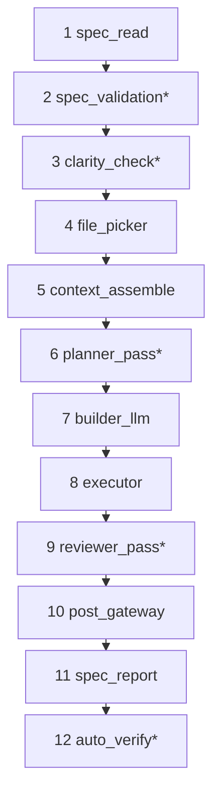
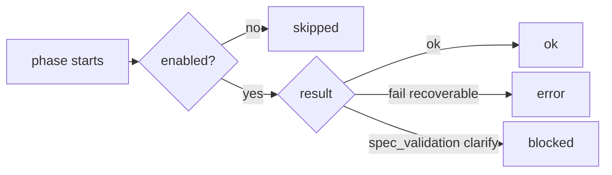

# T-06: The delegation pipeline

**Goal:** Understand every phase that runs on `delegate_to_agent` — in order, with timing, and with the config flags that turn each on or off. By the end you can read a `delegation_pipeline` JSON block and know exactly which phases ran, which were skipped, and where time went.

**Why this matters:** The pipeline is the whole machine. T-04 covers context compile in depth; T-05 covers history/revert. T-06 is how those pieces wire together end-to-end, plus the stages T-04/T-05 didn't cover: spec validation, post_gateway, spec report, and auto_verify.

**Prerequisites:** T-02 (JSONL records), T-03 (specs), T-04 (context compiler), T-05 (workspace history).

**Estimated time:** 20 min skim; +15 min if you run **§5** (CLI) or **§6** (JSONL) try-it blocks.

**How to use this tutorial:** First pass — §1 diagram + §2 status values + §4 config matrix. Second pass — **§5** `mcp-coder delegate` or **§6** against a real `delegations.jsonl` from your machine. **T-07** will walk one `delegation_id` through every artifact (JSONL → history → spec report → `inspect-context`); T-06 stays focused on the pipeline map and quick CLI reads.

---

## 1. The delegation pipeline



One straight chain — no nested boxes. Three logical groups:

| Group | Phases | What happens |
|-------|--------|--------------|
| **Prepare** | 1–7 | Read spec, validate intent, compile context, build brief — **no file edits on disk** |
| **Execute** | 8–9 | Aider runs SEARCH/REPLACE; reviewer scans result |
| **Wrap up** | 10–12 | Diff workspace, write spec report, optional pytest |

`*` = opt-in. Defaults: `spec_validation` on, `clarity_check` on, `builder_llm` on, `reviewer_pass` on. `planner_pass` on. `auto_verify` off.

ASCII equivalent:

```
delegate_to_agent(mode=implement, spec_path=..., task=..., ...)
  │
  ├─ 1  spec_read          parse spec contract — Files, policies, outcome rules
  ├─ 2  spec_validation*   cheap LLM — spec coherence → clarification_needed?  [BLOCKS]
  ├─ 3  clarity_check*     cheap LLM — task clarity → questions?                [BLOCKS]
  ├─ 4  file_picker        rg + spec paths + hints → candidate_files   [T-04 §4]
  ├─ 4b rag_retrieval      FTS: past delegations + file summaries → context_refs  [default on]
  ├─ 5  context_assemble   tiers → ContextPackage → mechanical brief   [T-04 §5]
  ├─ 6  planner_pass*      Sonnet LLM → ## Planner plan above brief    [T-04 §8a]
  ├─ 7  builder_llm        Flash LLM → ## Builder brief merged on top  [T-04 §8b]
  │
  ├─ SupervisorAgent loop  (one turn by default; max_turns configurable)
  │     ├─ 8  executor           Aider: SEARCH/REPLACE on fnames (supervised)
  │     └─ 9  reviewer_pass*     Flash LLM → advisory review of diff
  │
  ├─ 10 post_gateway       manifest diff → files_changed; scope audit  [T-05 §3]
  ├─ 11 spec_report        write .mcp-coder/specs/reports/*.md
  └─ 12 auto_verify*       pytest → outcome: success / partial

[BLOCKS] = pipeline stops here if the LLM returns questions; no executor runs, no files changed.
* = opt-in (default off: auto_verify; all others default on)
```

Phases 4–7 are covered in T-04. `rag_retrieval` (4b) runs between picker and assemble when `context_builder` + RAG flags are on (defaults). Phases 10–11 touch T-05 history. This tutorial fills in 2–3, 8–9, 11, 12 and shows how to read timing for all of them.

**When is `delegation_pipeline` present?** Only for **`mode=implement` with a valid spec**. Pass-through delegations, `mode=review`, invalid specs, or delegations without a `spec_path` may omit it entirely (T-02 §4).

---

## 2. What `delegation_pipeline` looks like in JSONL

Every phase emits a record under **`context.delegation_pipeline`** in JSONL (top-level `delegation_pipeline` in the MCP response — same data, different nesting; T-02 §4).

```json
"context": {
  "delegation_pipeline": [
    {"phase": "spec_read",        "status": "ok",      "duration_ms": 1},
    {"phase": "spec_validation",  "status": "ok",      "duration_ms": 679},
    {"phase": "file_picker",      "status": "ok",      "duration_ms": 5},
    {"phase": "context_assemble", "status": "ok",      "duration_ms": 73},
    {"phase": "planner_pass",    "status": "ok",      "duration_ms": 1277},
    {"phase": "builder_llm",      "status": "ok",      "duration_ms": 2446},
    {"phase": "executor",         "status": "error",   "duration_ms": 13066,
     "detail": "To implement the changes…"},
    {"phase": "post_gateway",     "status": "ok",      "duration_ms": 0},
    {"phase": "spec_report",      "status": "ok",      "duration_ms": 8},
    {"phase": "auto_verify",      "status": "skipped", "duration_ms": 0,
     "detail": "disabled_or_not_applicable"}
  ]
}
```

(Real record from a spec-backed implement run — executor failed mid-edit; post_gateway and spec_report still ran.)

### Status values

| Status | Meaning |
|--------|---------|
| `ok` | Phase ran and completed normally |
| `skipped` | Disabled by config or not applicable (no spec → `spec_validation` skips) |
| `error` | Phase failed non-fatally; pipeline often continues (executor error still runs post_gateway) |
| `blocked` | `spec_validation` or `clarity_check` returned questions — **no executor, no file edits** |



`detail` (optional string) — truncated error text or skip reason (e.g. `disabled_or_not_applicable` for `auto_verify`).

---

## 3. Phase-by-phase

### 1 — `spec_read`

Parses the spec file (T-03): front matter, `## Files`, policies, outcome rules.

- Runs when `spec_path` is provided.
- On failure (bad YAML, missing file): `status: error`; pipeline continues without spec contract.
- Outputs: `files_edit`, `files_read`, `edit_scope`, outcome rule list.

### 2 — `spec_validation` (default on)

A cheap LLM checks the spec against context (task, host transcript if available) and can return `clarification_needed` — which **blocks** the pipeline and returns the question to the planner before any file edits happen. Catches internally incoherent specs and contradictions.

Disable:

```yaml
# .mcp-coder/config.yaml
spec_validation: false
```

or `MCP_CODER_SPEC_VALIDATION=0`.

When blocked: JSONL `status: blocked`; response contains `clarification_needed: [...]`.

### 3 — `clarity_check` (default on)

A cheap LLM checks whether the task description itself is clear and actionable. Different from spec_validation (which checks the spec document) — clarity_check asks "does this task make sense for the executor to attempt right now?"

If the task is underspecified, it surfaces questions to the planner **before** the context compiler runs. Disable:

```yaml
clarity_pass: false
```

or `MCP_CODER_CLARITY_PASS=0`.

When blocked: same as spec_validation — `status: blocked`, `clarification_needed: [...]`.

### 4b — `rag_retrieval` (default on)

Runs after `file_picker`, before `context_assemble`. FTS over `delegation_rag.db` + `workspace_rag.db`; merges into `## Relevant prior work` and JSONL `context_refs[]`. Fast when indexes exist; skipped when `context_builder` off or all RAG flags off. **Not run** when spec_validation or clarity_check blocks.

Check hits without a full delegate:

```bash
mcp-coder search delegations "retry logic" --limit 3
mcp-coder search files "ledger" --limit 3   # needs index-workspace first
```

### 4 — `file_picker` → 5 — `context_assemble` → 6 — `planner_pass` → 7 — `builder_llm`

See **T-04** §4–§8 for full detail. Quick summary here:

| Phase | What it does | Opt-in? |
|-------|-------------|---------|
| `file_picker` | rg symbol scan + spec contract → ranked candidates | On when `context_builder: true` (default) |
| `context_assemble` | Tiers, payloads, mechanical brief, budget | Same |
| `planner_pass` | `## Planner plan` layer above brief | On by default; `planner_pass: false` disables |
| `builder_llm` | `## Builder brief` narrative on top | On by default; `context_builder_llm: false` disables |

**Dry-run phases 4–7 without a delegate** (no API call, no disk edits):

```bash
mcp-coder inspect-context \
  --workspace /path/to/project \
  --spec .mcp-coder/specs/tasks/my-step.md \
  --task "Add CLI entrypoint"
```

Shows tiers, picker candidates, and the mechanical brief — the same inputs phases 4–5 use before helper LLMs run (T-04 §0 playground for a full walkthrough).

### 8 — `executor` (inside supervisor loop)

Aider runs `coder.run(prompt)` with `fnames` (edit paths). This is where file edits happen on disk.

The executor runs inside the **SupervisorAgent loop**. By default (`supervisor_max_turns: 1`) there is one turn. Set `MCP_CODER_SUPERVISOR_MAX_TURNS=2` to allow autonomous retry if the reviewer finds issues.

While Aider runs, every `confirm_ask` decision (e.g. "run this shell command?", "add this file?") is routed to a supervisor LLM which approves, denies, or aborts — not auto-approved.

Key facts:
- Duration typically dominates the pipeline (LLM call inside Aider).
- Aider may touch files **not** in `fnames` mid-loop.
- Error here → `status: error`; `files_changed` still computed from manifest diff.
- Same-session caching: Aider `Coder` instance is reused across delegates in the same MCP session when workspace/model match → `executor_reused: true` in JSONL (faster; skips Aider init).

### 9 — `reviewer_pass` (default on)

After the executor finishes each turn, a lightweight reviewer LLM scans `files_changed` against the spec's acceptance criteria. Result is advisory — appended to the spec report, not a blocker. Disable:

```yaml
reviewer_pass: false
```

or `MCP_CODER_REVIEWER_PASS=0`.

The reviewer result appears in `delegation_pipeline` as `reviewer_pass` and in `model_roles` with its own token count.

### 8 — `post_gateway`

After the executor finishes:

1. **Manifest diff** (`walk_workspace` before vs after) → `files_changed`, `files_unexpected`.
2. **Scope violations** — paths changed outside `files_edit`; with `edit_scope: strict` + snapshots → auto-revert from blobs (T-05 §2).
3. **`judgment_checklist`** — structured list of what was touched, for the planner to review (T-03 §5).
4. **History commit** — `file_deltas`, unified diffs written to `workspace_history.db` (T-05).

### 9 — `spec_report`

Writes `.mcp-coder/specs/reports/<spec-filename>.md` with a Run log entry: timestamp, outcome, `files_changed`, `files_unexpected`, planner notes. Appends on retry (versioned specs T-03). Skips when no `spec_path`.

```bash
# After a spec-backed delegate — audit trail in-repo
ls .mcp-coder/specs/reports/
tail -20 .mcp-coder/specs/reports/my-step-report.md
```

### 10 — `auto_verify` (opt-in, off by default)

Runs `pytest` (or configured verify command) after a successful delegate. Sets `outcome` to `success` (tests pass) or `partial` (tests fail). Result feeds into spec report and builder history for the next attempt.

Enable:

```yaml
# .mcp-coder/config.yaml
auto_verify: true
auto_verify_cmd: "pytest tests/ -q"
```

When off or executor failed: `auto_verify` → `skipped`, `detail: disabled_or_not_applicable`.

---

## 4. Config flag matrix

| Flag | Default | Phases affected |
|------|---------|-----------------|
| `spec_validation` | **on** | Phase 2 (spec coherence gate) |
| `clarity_pass` | **on** | Phase 3 (task clarity gate) |
| `context_builder` | **on** | Phases 4–7 (picker, assemble, planner, builder) |
| `context_builder_llm` | **on** | Phase 7 (builder brief) |
| `planner_pass` | **on** | Phase 6 (planner plan LLM) |
| `builder_history_rag` | **on** | Phase 4b — delegation hits in builder |
| `workspace_file_rag` | **on** | `workspace_rag.db` + search |
| `workspace_file_hints` | **on** | File hits in picker + brief |
| `reviewer_pass` | **on** | Phase 9 (advisory reviewer scan) |
| `auto_verify` | **off** | Phase 12 |
| `host_transcript` | `none` | Phases 2, 3, 6–7 (helper LLMs see transcript when `dump`) |
| `edit_scope` | `discover` | Phase 10 (`strict` → auto-revert violations) |
| `MCP_CODER_SUPERVISOR_MAX_TURNS` | `1` | Supervisor loop turns (set `2`–`3` for retry) |
| `MCP_CODER_CONTEXT_BUDGET_ENABLED` | `1` | Phase 5 budget degradation |
| `MCP_CODER_DISABLE_WORKSPACE_SNAPSHOT` | `0` | Phase 10 (off → no manifest diff, no blobs) |

---

## 5. CLI — run the pipeline without Cursor

`mcp-coder delegate` calls the same code path as MCP `delegate_to_agent`. Output is a structured envelope:

| Field | Contents |
|-------|----------|
| `artifacts.executor_in` | Full prompt + `fnames` sent to Aider |
| `artifacts.executor_out` | Aider `output`, `files_changed`, `files_unexpected` |
| `artifacts.post_delegate` | `post_gateway`, `spec_report_path`, `verify_result`, `delegation_pipeline`, … |
| `caller_response` | Exact MCP JSON (what Cursor would receive) |

**Prepare only** (phases 1–6, no file edits) — same helper/config behavior as a real delegate:

```bash
mcp-coder delegate \
  --spec tasks/my-spec.md \
  --task "..." \
  --target-files src/foo.py \
  --context-summary "..." \
  --stop-after context \
  --pretty | jq '.artifacts.executor_in.prompt'
```

**Full run** (pre + executor + post):

```bash
mcp-coder delegate \
  --spec tasks/my-spec.md \
  --task "..." \
  --target-files src/foo.py \
  --context-summary "..." \
  --pretty
```

For opt-in helper debugging with manual flags, use `inspect-context` (T-04 §14). For delegate-faithful compile (config-driven helpers + host transcript policy), use `delegate --stop-after context`.

---

## 6. Try it — read pipeline timing from JSONL

These commands inspect **phase timing and status** only. For a full walk (same `delegation_id` → history diff → spec report → context reconstruction), use **T-07** when it ships.

### Find your JSONL

From the project root (after T-01):

```bash
# Option A — session pointer (T-02)
SESSIONS=$(python3 -c "import json; print(json.load(open('.mcp-coder/session.json'))['sessions_root'])")
ls "$SESSIONS"/*/delegations.jsonl

# Option B — search all projects
find ~/.mcp-coder -name delegations.jsonl | head -5
```

Pick one session file, or merge all sessions for the latest record (Option C):

```bash
# Option C — latest record across every session dir
SESSIONS=$(python3 -c "import json; print(json.load(open('.mcp-coder/session.json'))['sessions_root'])")
cat "$SESSIONS"/*/delegations.jsonl | jq -s 'sort_by(.timestamp_start) | last' > /tmp/latest-delegation.json

# Or Option A/B — last line of one session file
LOG="$SESSIONS/<mcp_session_id>/delegations.jsonl"
tail -1 "$LOG" > /tmp/latest-delegation.json

REC=/tmp/latest-delegation.json
```

### Extract the pipeline block

```bash
jq '.context.delegation_pipeline' "$REC"
# or, for a single LOG file:  tail -1 "$LOG" | jq '.context.delegation_pipeline'
```

If the result is `null`, that record has no pipeline (review mode, no spec, or delegation without a `spec_path`). Pick another line or run a new spec-backed `implement` delegate (T-01).

### Sort phases by time (find the bottleneck)

```bash
jq -r '
  .context.delegation_pipeline
  | sort_by(-.duration_ms)
  | .[]
  | "\(.phase)\t\(.status)\t\(.duration_ms)ms"' "$REC"
```

**Example output** (same run as §2):

```
executor        error   13066ms
builder_llm     ok      2446ms
planner_pass    ok      1277ms
spec_validation ok      679ms
context_assemble ok     73ms
spec_report     ok      8ms
file_picker     ok      5ms
spec_read       ok      1ms
post_gateway    ok      0ms
auto_verify     skipped 0ms
```

`executor` usually wins; helper LLMs (`builder_llm`, `planner_pass`) are next when enabled.

### Phases that did not finish cleanly

```bash
jq '[.context.delegation_pipeline[] | select(.status != "ok")]' "$REC"
```

**Example:**

```json
[
  {
    "phase": "executor",
    "status": "error",
    "duration_ms": 13066,
    "detail": "To implement the changes for the `stats` command…"
  },
  {
    "phase": "auto_verify",
    "status": "skipped",
    "duration_ms": 0,
    "detail": "disabled_or_not_applicable"
  }
]
```

`error` on `executor` + `skipped` on `auto_verify` is normal when the executor fails or verify is off. `blocked` on `spec_validation` means the planner should answer `clarification_needed` before retrying.

### Correlate with `history` (phases 8–9)

Pipeline JSONL tells you **how long** post_gateway took; `history` tells you **what changed**:

```bash
ID=$(jq -r .delegation_id "$REC")
mcp-coder history show "$ID"
mcp-coder history diff "$ID" --path src/api.py   # optional single file
```

`history show` does not repeat `delegation_pipeline` — use JSONL (or `mcp-coder view delegations`) for phase timing, and `history` for checkpoints and diffs (T-05 §4).

### Browser UI (optional)

```bash
mcp-coder view delegations --workspace /path/to/project
```

List view is structured and expanded detail uses the boundary viewer: chronological boundary rows plus a detail panel for each crossing. Keep the `jq` snippets handy when you want to script/filter raw fields directly from JSONL.

### What to look for

| Signal | Likely cause |
|--------|----------------|
| `executor.duration_ms` ≫ everything else | Normal — dominates wall time |
| `builder_llm` / `planner_pass` high with `ok` | Slow model or large brief; check `context.prompt_chars` in same JSONL line |
| `context_assemble` high | Large workspace or many spec read paths; budget may have degraded (T-04 §7) |
| `post_gateway` high | Large manifest walk; many files in workspace |
| `spec_validation` → `blocked` | Spec is ambiguous; fix spec or answer clarification |
| `clarity_check` → `blocked` | Task description is underspecified; clarify before retrying |
| No `delegation_pipeline` key | Not implement+spec; see T-02 §4 |

---

## 6. Mode differences

The pipeline does **not** run the same way for every mode:

| `mode` | Phases that run |
|--------|----------------|
| `implement` | All 10 (opt-ins depend on config) |
| `review` | Skips phases 3–7 (no context compile, no executor); spec_validation, spec_report may run |
| No `spec_path` | Phase 1 skipped; phases 2, 9 skip; 3–6 still run without spec contract |

---

## 7. Code map

| Concern | Location |
|---------|----------|
| Full pipeline orchestration | `server/mcp_server.py` — `delegate_to_agent` handler |
| Pipeline recorder | `core/pipeline/phases.py` — `PipelineRecorder` |
| Spec read | `core/specs/read.py` |
| Spec validation LLM | `core/engine/spec_validation_llm.py` |
| Clarity check LLM | `core/context/clarity_llm.py` |
| Context phases | `core/context/` — T-04 code map |
| Planner pass LLM | `core/engine/planner_pass_llm.py` |
| Supervisor agent loop | `core/engine/supervisor_agent.py` |
| Executor adapter | `core/engine/aider_engine.py` |
| Supervised IO (confirm_ask routing) | `core/engine/supervised_io.py` |
| Reviewer LLM | `core/engine/reviewer_llm.py` |
| Post-gateway scope audit | `core/workspace/gateway.py` |
| Spec report write | `core/specs/write.py` |
| Auto-verify | `core/config/auto_verify.py`, `core/engine/auto_verify.py` |

---

## Next

- **T-07 (End-to-end trace):** one real `delegation_id` — JSONL line → `history show` / `diff` → spec report → `inspect-context` reconstruction (all tools from T-01–T-06 in one narrative)
