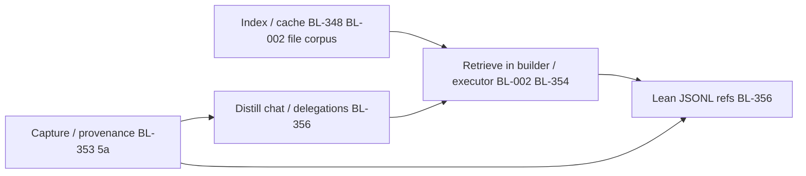

# RAG gap analysis — living note

**Status:** Living note — update as we dogfood, tutorial, and plan Phase 5.  
**Not canonical vision** — see [IDEA.md](../IDEA.md). PM backlog: [BL-002](../BACKLOG.md#bl-002-rag--cross-session-memory), [BL-348](../BACKLOG.md#bl-348-incremental-workspace-code-intel-cache-high-roi-context)–[BL-356](../BACKLOG.md#bl-356-rag-backed-context-audit-refs--lean-jsonl--digest-provenance).  
**Origin:** T-04 context-compiler tutorial pass (2026-06-11) — visibility into compile → helper LLMs → Aider wire format; observability gaps (BL-353/356); “where does RAG actually help?”

---

## Why this note exists

Phase 4 shipped a **context compiler** (picker → assemble → builder → budget → executor). Phase 5 is scoped around **RAG** ([BL-002](../BACKLOG.md#bl-002-rag--cross-session-memory)), but “use RAG” is easy to say and hard to scope. Several problems we surfaced in discussion **look** like RAG but are actually **logging**, **caching**, or **DB lookup**.

This note captures:

1. Which gaps are **genuinely retrieval-shaped** vs mislabeled.
2. The **corpora** we expect to index (and what we explicitly skip).
3. **Dependency order** — capture → index → distill → retrieve.
4. **Highest-ROI** wins vs deferred bets.
5. **Open questions** for the Phase 5 RAG master session.
6. **Phase 5 MVP candidate** — suggested milestones, reasoning, and what waits for later phases.

**How to use:** After each tutorial pass, dogfood session, or planning chat, add rows to § Open evidence, update § Changelog, and adjust priority if reality shifts.

---

## Litmus test — is this actually RAG?

Something is **RAG-shaped** when **all** of these hold:

| # | Criterion | Meaning |
|---|-----------|---------|
| 1 | **Corpus too big** | Cannot paste everything into one prompt every delegate. |
| 2 | **Relevance varies** | The right slice changes per task / spec / chat. |
| 3 | **Reusable** | Worth indexing once, querying many delegations. |
| 4 | **Fuzzy match** | Need keyword/semantic search — not a single exact key. |

**If lookup is by exact key** (`spec_id`, `delegation_id`, file path, sha256) → **DB / index query**, not RAG.  
**If the problem is “we never recorded it”** → **observability** ([BL-353](../BACKLOG.md#bl-353-llm-boundary-observability--full-pass-through-logging)), not RAG.  
**If we re-derive the same facts every run** → **cache / code-intel index** ([BL-348](../BACKLOG.md#bl-348-incremental-workspace-code-intel-cache-high-roi-context)); RAG may sit on top later.

---

## Gaps from T-04 / observability discussion — sorted

| Gap | Today | RAG-shaped? | Right tool | Backlog |
|-----|-------|---------------|------------|---------|
| “Which **files** matter for this task?” beyond spec + `rg` symbol hits | Picker: contract + symbol scan; no semantic “similar API” | **Yes — core** | Workspace file summaries + FTS | **BL-002** |
| “What did we learn in **prior delegations**?” (cross-spec) | Builder history: last N same-spec + project rows, **recency not relevance** | **Yes** | Delegation RAG (shipped P3-002-lite) — **wire into builder** | **BL-002** |
| “What did we **decide in chat** sessions ago?” | `host_transcript: dump` all-or-nothing; hash + line counts only in JSONL | **Yes, after distillation** | Curated session digests — **not** raw chat RAG | **BL-356** |
| **Library / external docs / skills** | Not indexed; skills = future idea | **Yes** | Topic → doc/skill retrieval | **BL-008**, extend **BL-002** |
| **API catalog** (signatures, imports, module shape) | Regex `def`/`class` + `rg` every delegate | **No (index)**; RAG on top optional | Persisted code-intel cache | **BL-348** |
| **Recently touched files** | Per-delegate `files_changed`; no session/project aggregate | **No** | Recency + git/manifest fusion | **BL-349** |
| **Helper LLM inputs / wire traffic** | Flags only (`builder_brief_applied`); no input prompts in JSONL | **No** | Pass-through logging + trace files | **BL-353** |
| **Executor multi-turn** inside Aider | Black box; one `coder.run()` | **No** (capture first) | LiteLLM tap; optional pull tools mid-loop | **BL-353**, **BL-354**, **BL-350** |
| **Reasoning / thinking tokens** | Stripped before storage | **Later** | Capture → optional reuse as retrieval | **BL-333**, **BL-353** |
| **Lean JSONL** (refs not bodies) | `prompt_full` opt-in bloats logs | **Consumer of RAG** | `context_refs[]` join audit ↔ index | **BL-356** |
| **Cursor transcript line provenance** | `lines_parsed` / hash; no “through line N” | **No** (provenance) | Extend `transcript_log_context` | **BL-353** slice 5a |
| **Executor pulls context mid-loop** | Planner MCP tools exist; Aider cannot call them | **Hybrid** | Read-only tools + audit each query | **BL-354** |

---

## Four retrieval corpora (the real RAG surface)

When non-RAG items are stripped away, Phase 5 retrieval collapses into **four corpora** with different lifecycles:

### 1. Workspace source files (primary — BL-002)

| Field | Value |
|-------|--------|
| **Question** | “What does this file do?” “What files relate to X?” |
| **Unit** | File-level summary + symbol list (sha256 staleness) |
| **Update** | On file change (snapshot / post-delegate hook) |
| **Search** | FTS5 on summary + symbols (embeddings deferred) |
| **Consumers** | Planner `workspace_search`; context **picker/builder** hints; eventually **BL-354** executor-pull |
| **Not RAG** | Exact path read, spec `### Read` contract |

**Gap today:** Symbol scan finds literal mentions (`get_user`), not “same concept, different name.” Summaries fix fuzzy **file-level** recall.

### 2. Delegation memory (partially shipped)

| Field | Value |
|-------|--------|
| **Question** | “What was tried before?” “How did we fix this bug last time?” “How did we implement auth last month?” |
| **Unit** | Delegation record digests (outcome, files, checkpoint summary) + **Historical Specs** |
| **Update** | Append on each delegate |
| **Search** | `rag_search` / FTS (P3-002-lite) |
| **Consumers** | Planner MCP today; **builder should query by relevance**, not only recency |
| **Why include specs** | A spec without its outcome is just an idea. Indexing historical specs *alongside* the delegation that fulfilled them gives the full "problem → solution" pattern. |

**Sharpest gap:** Delegation #12 (spec A) learns “token refresh lives in `session.py`.” Delegation #20 (spec B) touches `auth.py` — builder **won’t see #12** unless same `spec_id`. **Highest-ROI wiring** over existing index.

### 3. Distilled session / chat decisions (not built — BL-356)

| Field | Value |
|-------|--------|
| **Question** | “What did we agree about auth last week?” “Get context from older finished MCP sessions.” |
| **Unit** | Curated digests (outcome-labeled chunks), not raw Cursor JSONL |
| **Update** | Distillation job (session end? delegate success?) |
| **Search** | FTS / semantic on digest text |
| **Consumers** | Builder, spec validation, planner |
| **Why not raw chat** | [BL-002](../BACKLOG.md#bl-002-rag--cross-session-memory) rejected raw transcript — noise, rejected ideas indistinguishable from accepted |

**Bridge until then:** `host_transcript: dump` + **BL-353** line/byte provenance (know what was in scope, not retrieve old decisions).

**Planned mechanism (Phase 5+ — not MVP):** two-tier transcript memory:

```
[ hot window ]     recent N turns/tokens → inject RAW in prompt (direct, no LLM)
       │  turns age out of window on each delegate
       v
[ cold tail ]      LLM distillation → upsert to RAG (Corpus 3) with line metadata
```

**Why not continuous “online” RAG:** mcp-coder is not a live Cursor listener — it only reads transcript JSONL **at delegate time**. Natural triggers: per-delegate delta digest, session end, or explicit planner action. No socket/stream today.

**Cheap win before distillation:** bound `host_transcript: dump` to a **recent window** (not all-or-nothing) — no RAG, no extra LLM; can land near P5-2 era.

**Open design (when scoped):** window size (tokens vs turns); upsert vs append when decisions reverse; digest only delta since last provenance marker (**BL-353**).

### 4. External knowledge (under-discussed)

| Field | Value |
|-------|--------|
| **Question** | “How does library X work?” “What is the standard pattern for this auth flow?” “Is there a known bug for this error?” “How did we solve this in our *other* project?” |
| **Unit** | Curated skills files, fetched docs, book-agent outputs, **cross-project RAG federations** |
| **Update** | Manual or periodic index |
| **Search** | Topic-keyed retrieval |
| **Consumers** | Planner before delegate; builder preamble (explicitly invoked to avoid noise) |

**Gap today:** No corpus. **BL-008** (skills injection) is adjacent — may share index machinery with BL-002.

**Three tiers for “global” / external patterns** (not one binary choice):

| Tier | What | When | RAG? |
|------|------|------|------|
| **A — Live web search** | Planner/executor hits web for this issue *now* | First encounter, time-sensitive, library-specific bug reports | **No** — ephemeral tool result |
| **B — Curated localization** | Web search → try pattern/solution → **save only if it worked** → local corpus for reuse | Same *class* of problem recurs; avoid indexing noise | **Yes** — Corpus 4, **outcome-gated** ingest |
| **C — Cross-project / global DB** | Query other workspaces’ RAG or a shared `global_rag.db` | “How did *we* solve this elsewhere?” | **Yes** — federation; invoke explicitly |

**Hypothesis (H6):** Across many workspaces we hit the **same problem types** (auth flows, OAuth quirks, framework bugs, stack-specific patterns). Tier **B** captures the payoff: one pattern that **actually worked** → reused on the next similar task without re-searching.

**Ingest rule — save only what worked (not everything found):**

- **Do not** index every web hit, blog post, or snippet we *might* use.
- **Do** localize after we **tried** a pattern/idea/solution and can label outcome: helped / didn’t help / partial.
- Failed attempts stay in delegation audit (**Corpus 2**) or traces (**BL-353**) — not Corpus 4 unless we want a short “avoid this” note with `outcome: failed`.

This mirrors Corpus 3 (don’t index raw chat) and BL-002’s rejection of unlabeled transcript noise: **outcome labels are the filter**.

**Localization pipeline (Tier B — suggested shape, Phase 5+ / ~8–9):**

```
issue / error / task
    → web_search or paste URL (Tier A — ephemeral, not stored)
    → apply pattern in delegate / manual try
    → post-run: did it help? (planner, spec report, delegate success)
         ├─ no  → discard or log in delegation history only
         └─ yes → normalize to markdown chunk(s) + metadata:
                  source_url, applied_in_delegation_id, problem_class,
                  stack tags, sha256, outcome: worked
              → index Corpus 4 (workspace references/ or global skills/)
    → later: retrieve(query, corpus=external) when explicitly needed
```

**Why not skip straight to internet-scale RAG:** Crawling/indexing the open web is cost, staleness, and junk. **Outcome-gated localization** keeps Corpus 4 small and high-signal — same discipline as “good decisions land in specs,” but for **external** patterns we validated in practice.

**Note on cross-project RAG (Tier C):** Today per-workspace (`~/.mcp-coder/projects/<key>/workspace_rag.db`). Later: federation across workspaces or `global_rag.db` for shared patterns. Keeping Tier B/C **explicitly separate** from Corpus 1 prevents irrelevant external noise in normal single-project work.

---

## What is NOT RAG (avoid scope creep)

| Problem | Solution family | Why not RAG |
|---------|-----------------|-------------|
| **Active Epics / Tasks** | Direct read / `grep` | Too small to index (5-50 files). Only *historical* specs need RAG (via Delegation Memory). |
| Log helper/builder **input prompts** | BL-353 trace file | Recording, not searching |
| Full **executor prompt** in audit | `prompt_full` / traces / BL-353 | Same |
| **Repo map / symbol outlines** | BL-348 persisted index | Deterministic structure from AST/heuristics |
| **Recent files list** | BL-349 ranking | Time/recency sort |
| **Spec contract paths** | Spec parser + assemble | Exact contract |
| **File payloads in prompt** | Tiers + budget (T-04) | Compiler push — retrieval is optional add-on |

**Trap:** “We can’t see what the builder saw” feels like retrieval — it’s **observability first**. You cannot retrieve what you never stored or cannot address with stable refs (**BL-356**).

---

## Dependency order (recommended sequencing)



| Stage | Delivers | Unblocks |
|-------|----------|----------|
| **Capture** | Transcript line refs, token counts, compile bundle hashes | Honest distillation; debug without re-run |
| **Index** | File summaries, symbol catalog, delegation FTS | Real `workspace_search`; better picker hints |
| **Distill** | Session decision chunks with metadata | Chat-as-RAG without raw JSONL noise |
| **Retrieve** | Builder queries corpora; optional executor-pull | Cross-spec memory, fuzzy file recall |
| **Lean logs** | `context_refs[]` in JSONL | Scale audit without duplicating bodies |

Phase 5 **RAG master session** should not skip **capture + file index** and jump to embeddings.

---

## Compile-push (A) vs executor-pull (B)

Two intentional models ([BL-354](../BACKLOG.md#bl-354-executor-context-tools-pull--raghistoryread-during-backend-loop)):

| Mode | When | RAG role |
|------|------|----------|
| **A — Compile-push** | Before `coder.run()` | Picker/builder **front-load** retrieved chunks into `ContextPackage` |
| **B — Executor-pull** | During Aider loop | Model calls `rag_search` / `workspace_search` when stuck |

**Today:** A only (and even A uses rules + `rg`, not RAG indexes in the builder).  
**Dogfood order:** Wire delegation RAG into **builder (A)** first — simpler audit than mid-loop tools.

---

## Observability ↔ RAG coupling

Full delegate ([T-04](../guide/tutorials/04-context-compiler.md)) writes one `delegations.jsonl` row. See [T-02](../guide/tutorials/02-sessions-storage-logs.md) § JSONL.

| Stored today | Missing | Phase 5+ direction |
|--------------|---------|-------------------|
| `delegation_pipeline` timings | Per-LLM bodies | BL-353 traces |
| `context_package` tiers (no payloads) | Builder **input** prompt | Trace file + hashes |
| `adapter_in` / `prompt_preview` | CLI `artifacts` not in JSONL | Mirror refs or trace pointer |
| `host_transcript_path`, hash, `lines_parsed` | **Source line range** | BL-353 5a |
| Helper flags | Raw completions | BL-353 5b |

When RAG corpora exist, JSONL should hold **`context_refs[]`** (kind, id, sha256, line range) — not duplicate chunk text ([BL-356](../BACKLOG.md#bl-356-rag-backed-context-audit-refs--lean-jsonl--digest-provenance)).

**Index-time metadata** every digest/chunk should carry for replay:

- `source_kind` — `cursor_transcript` | `delegation` | `workspace_file` | `spec` | `llm_trace`
- `source_path` or `delegation_id` / `spec_id`
- `source_line_range` or `byte_range`
- `sha256` at index time
- `indexed_at`, invalidation hash
- optional `outcome` / labels (for chat distillation)

---

## Retention, pruning & long-term maintenance (later — not today)

We will **accumulate** data in several places — RAG DBs, `delegations.jsonl`, trace files, `workspace_history.db`, distilled chunks. We **cannot** keep everything forever, but we **do** want to keep good stuff. Different layers have different lifetimes.

### Lifetimes by layer (intent)

| Layer | Typical scope | Retention bias | After prune, what survives |
|-------|---------------|----------------|----------------------------|
| **Corpus 1** — workspace files | Per-project | Refresh on sha256 change; drop stale summaries | Re-index on next edit |
| **Corpus 2** — delegations | Per-project | **Shorter** — project audit, replay while active | Promote distilled lessons → Corpus 3/4 or spec reports |
| **Corpus 3** — chat digests | Per-session / cross-session | Medium — decisions worth keeping | Raw transcript can go |
| **Corpus 4** — worked patterns, skills, localized web | **Global / long-term** | **Keep** — outcome-gated, small, high signal | Source URL + delegation ref for provenance |
| **JSONL + traces (BL-353)** | Per-session | **Shorter** — forensics window | Lean row + `context_refs[]` (**BL-356**) points at promoted digests |
| **Checkpoints / blobs** | Per-project | Policy-driven (BL-322g restore deferred) | Manifest + summary in history DB |

**Key idea:** **Promote then prune.** Before deleting old delegation RAG rows or compacting JSONL, extract what mattered (outcome `worked`, checkpoint summary, localized pattern) into long-term corpora or specs. Project-scoped noise goes away; global good stuff stays.

### Why a global DB helps space (vision)

If Corpus 4 / tier B patterns live in `~/.mcp-coder/global/` (or federated global RAG), per-workspace delegation indexes can be **trimmed** once lessons are promoted — same pattern referenced once globally instead of duplicated per `project_key`. Not required for Phase 5; design retrieval refs so promotion does not break replay.

### Tools we will need eventually (not Phase 5)

| Tool / policy | Purpose |
|---------------|---------|
| **`mcp-coder maintenance` / `gc`** | Report disk by layer; optional prune with dry-run |
| **TTL / max-rows** | Per workspace: e.g. delegation RAG > N days or > M MB |
| **Promote** | Copy digest → global Corpus 4 with `promoted_from: {delegation_id, workspace}` |
| **Archive** | Move old session JSONL/traces to cold storage (tar + index manifest) |
| **Dedupe** | By `sha256` across global store — one copy of same worked pattern |
| **Stale invalidation** | File summary stale after sha256; global pattern stale if stack tag obsolete |

**Non-goals for v1 maintenance:** auto-delete without promote path; silent prune of checkpoints user might restore.

**Backlog:** [BL-357](../BACKLOG.md#bl-357-storage-lifecycle--promote-prune-gc-logs--rag--traces) — cross-cutting storage lifecycle (logs, RAG, traces, checkpoints, not RAG-only). Pairs with [storage-and-linking.md](./archive/storage-and-linking.md).

---

## Highest-ROI hypotheses (to validate in dogfood)

| # | Hypothesis | Validate how |
|---|------------|----------------|
| H1 | **Cross-spec delegation retrieval** helps builder more than bigger `context_summary` | Delegate two specs sharing a module; inspect whether builder history missed the prior run |
| H2 | **File summaries** improve picker vs `rg` alone on rename/refactor tasks | T-04-style playground with synonym symbols |
| H3 | **FTS suffices** for Phase 5 — embeddings not needed yet | Measure recall on 20 real planner queries |
| H4 | **Raw chat RAG** hurts more than helps | Compare dump vs digest on noisy sessions |
| H5 | **Lean refs** keep JSONL usable at 100+ delegates | Size row with refs only vs `prompt_full` |
| H6 | **Outcome-gated localization** (save only what worked) beats indexing all web hits | After 3–5 auth/OAuth solves, only persist winners; measure retrieval hit rate vs re-search |

Add results to § Open evidence as we learn.

---

## RAG ≠ embeddings (FTS is enough to start)

**RAG** = fetch relevant text and put it in the prompt. **How** you find “relevant” is a separate choice.

| | **Keyword / lexical (FTS)** | **Semantic / vectors (embeddings)** |
|---|---------------------------|-------------------------------------|
| **Mechanism** | Match words; rank by BM25 / FTS5 | Embed text → vectors; cosine similarity |
| **In repo today** | **Yes** — `core/rag/` + SQLite FTS5; delegation RAG (P3-002-lite) already works **without** embeddings | Not built |
| **Strength** | Fast, free, no extra model calls; great for symbols, paths, spec terms | “Same meaning, different words” (e.g. task says “user record”, code has `fetch_account`) |
| **Weakness** | Misses synonym / paraphrase unless summaries use searchable words | Extra cost, latency, storage, re-embed on change; tuning surface |
| **Phase 5 default** | **Ship and measure** (H3) | **Only if** P5-5 recall metric says FTS + summaries insufficient |

**Why summaries make FTS punch above its weight:** Corpus 1 entries are LLM-generated prose (“fetches user account from API”) — FTS can match natural-language queries even when symbol names differ. Embeddings become a **measured upgrade**, not an MVP prerequisite.

---

## Phase 5 MVP candidate (locked — see PHASE5_MVP.md)

**Status:** **Locked 2026-06-13** — promoted from planning note to [PHASE5_MVP.md](../PHASE5_MVP.md). Milestones P5-001…P5-005 are the authoritative source. This section preserved as design rationale.

### Philosophy — what Phase 5 is vs later phases

| Horizon | Role | RAG focus |
|---------|------|-----------|
| **Phase 5** | **Infra + connect** — retrieval contract, wire existing + one new corpus into builder/picker, measure FTS | Delegation memory (shipped index) + workspace-file summaries; relevance over recency |
| **Phase 5+ / 6** | Harden — observability traces, executor-pull, lean JSONL refs | Corpus 3 distillation, BL-354 tool audit |
| **~Phase 8–9 (vision)** | **Advanced use cases** once basics are tested in production dogfood | Cross-project federation, global patterns, reasoning reuse, embeddings if needed, internet-scale patterns via tools not local index |

Phase 5 should **not** try to solve every corpus or every advanced pattern. Goal: prove the **plumbing** (`retrieve → ContextRef → builder`) on corpora we can index reliably, then add sophistication when missing pieces (capture, distillation, multi-backend pull) exist.

**One-line phase goal:** Move the context builder from *recency + `rg`* toward *relevance retrieval*, starting with delegation RAG (already indexed) and workspace-file summaries (highest new corpus ROI).

**North-star acceptance (dogfood):** Builder pulls a relevant fact from a **different spec’s** prior delegation **and** a file the symbol scan would have missed — both visible in audit (`context_refs` / source counts).

### Retrieval contract (prevents lock-in to one milestone)

Define once in P5-1; every later corpus plugs in the same shape:

```text
retrieve(query, corpus, k) -> [ContextRef]
```

```text
ContextRef { kind, id, sha256, snippet, score, source_line_range?, corpus }
```

- **P5-2…P5-4** only add `corpus` values and consumers — not new ad-hoc joins.
- Pre-shapes **BL-356** lean JSONL (`context_refs[]`) — audit replay without duplicating bodies.

### Milestones (incremental — each shippable)

| ID | Milestone | What | Why this order | RAG? | Can exit phase here? |
|----|-----------|------|----------------|------|----------------------|
| **P5-1** | **Retrieval contract** | `ContextRef` + `retrieve()` over existing delegation `core/rag/search` | Seam before behavior change; same API for all corpora | Plumbing | Partial — contract only |
| **P5-2** | **Relevance delegation history → builder + delegation search CLI** | FTS query from task + spec Goal; merge with recency/same-spec; audit `builder_history_source`; `mcp-coder search delegations` CLI with `--format plain` | **H1** — shipped index, highest ROI wiring; cross-spec memory; CLI pre-shapes BL-354 | **Full** | **Yes — minimum viable Phase 5 exit** |
| **P5-3** | **Workspace-file corpus** | Per-file LLM summary + symbols; sha256 staleness; FTS in `workspace_rag.db`; `workspace_search` MCP + `mcp-coder search files` CLI (`--format plain`) | **BL-002 primary** corpus; fixes "concept ≠ symbol name" at file level; CLI pre-shapes BL-354 | **Full** | Yes |
| **P5-4** | **Picker/builder consume file corpus** | Retrieval hints into picker or builder prompt | **H2** — closes fuzzy file recall in compile-push (A) | **Full** | Yes — “full” MVP |
| **P5-5** | **Measure + lean-ref seam** | FTS recall metric (H3); `context_refs[]` in JSONL; thin **BL-335** token slice if needed | Decides embeddings; keeps logs scalable | Consumer | Capstone |

**Config toggles per milestone** (`builder_history_rag`, `workspace_file_rag`, …) — default off until dogfood proves value; avoids baking behavior in before measurement.

**Dependencies to flag:** P5-5 leans on **BL-335** tokens; P5-3 can ship **summaries** without full **BL-348** AST index (merge later).

### Explicitly NOT in Phase 5 MVP (and where it goes)

| Item | Why defer | Target phase |
|------|-----------|--------------|
| **Corpus 3 — chat distillation → RAG** | Needs BL-353 provenance + LLM distill quality; raw chat rejected | 5+ / 6 (**BL-356**) |
| **Hot transcript window only** (no RAG) | Small, valuable — but separate from retrieval | 5+ near P5-2 (config on `host_transcript`) |
| **Embeddings / vector store** | FTS + summaries first; H3 decides | 5+ only if measured miss rate |
| **Executor-pull (BL-354)** | Harder audit; compile-push must work first | 5+ |
| **Cross-project / global RAG (Corpus 4 tier C)** | Noise risk; explicit invoke only | ~8–9 vision |
| **Curated web localization (Corpus 4 tier B)** | Needs ingest pipeline + triage UX; stacks on P5 retrieval contract | 5+ / ~8–9 after per-workspace RAG works |
| **Live web search only (tier A)** | Always available as tool; not stored | Tooling (no RAG) |
| **Internet-scale crawl/index** | Junk, staleness, cost — rejected | Not planned |
| **Full wire logging (BL-353 5b/6)** | Cross-cutting; P5-5 takes refs + tokens slice only | 6 |
| **Reasoning trace reuse (BL-333)** | Capture before reuse | 6+ |
| **Retention / gc / promote-prune** | Need promote path + Corpus 4 global first | **BL-357** Phase 6+ |

### Minimum vs full Phase 5 exit

| Exit | Includes | Delivers |
|------|----------|----------|
| **Minimum** | P5-1 + P5-2 | Cross-spec delegation relevance in builder; retrieval contract for future corpora |
| **Recommended** | P5-1 … P5-4 | + workspace-file recall in compile path |
| **Full** | P5-1 … P5-5 | + measurement, lean refs, embedding go/no-go |

---

## Open questions (Phase 5 master session)

1. **Primary pain:** within-repo recall (files + history) vs cross-repo / external docs?
2. **Builder integration:** explicit `rag_search` call in pipeline vs implicit retrieval step before `build_builder_llm_prompt`?
3. **Chat distillation trigger:** session end, successful delegate, manual planner action?
4. **Embeddings:** defer until FTS miss rate measured — what threshold triggers BL-002 embedding slice?
5. **Executor-pull (BL-354):** Phase 5 or 5+ — does dogfood need it before workspace-file RAG is solid?
6. **Corpus boundaries:** same DB for file + delegation digests vs separate stores (BL-002 locked separate lifecycles)?
7. **Web localization store:** per-workspace `references/` vs `~/.mcp-coder/global/` for stack-wide patterns (OAuth, FastAPI, etc.)?
8. **Outcome gate:** who marks “worked” — planner after review, auto on `outcome: success` + spec report, or explicit `localize_reference` MCP tool?
9. **Failed external tries:** store `outcome: failed` in Corpus 4 (avoid list) or only in delegation RAG?
10. **Retention defaults:** TTL for per-project delegation RAG vs immortal global Corpus 4 — when to auto-promote before prune?

---

## Related backlog & docs

| ID | Topic |
|----|--------|
| [BL-002](../BACKLOG.md#bl-002-rag--cross-session-memory) | RAG umbrella — corpus decisions, Phase 5 plan |
| [BL-348](../BACKLOG.md) | Code-intel cache (substrate, not RAG) |
| [BL-349](../BACKLOG.md) | Recent files (recency, not RAG) |
| [BL-353](../BACKLOG.md#bl-353-llm-boundary-observability--full-pass-through-logging) | LLM wire logging + provenance |
| [BL-354](../BACKLOG.md#bl-354-executor-context-tools-pull--raghistoryread-during-backend-loop) | Executor-pull retrieval |
| [BL-356](../BACKLOG.md#bl-356-rag-backed-context-audit-refs--lean-jsonl--digest-provenance) | Lean JSONL + digest metadata |
| [BL-357](../BACKLOG.md#bl-357-storage-lifecycle--promote-prune-gc-logs--rag--traces) | Storage lifecycle — promote, prune, gc (logs + RAG + traces) |
| [BL-333](../BACKLOG.md) | Reasoning trace reuse |
| [BL-335](../BACKLOG.md) | Per-role token audit |
| [T-04](../guide/tutorials/04-context-compiler.md) | Context compiler — what executor sees |
| [T-02](../guide/tutorials/02-sessions-storage-logs.md) | JSONL shape |
| [phase2-owned-context.md](./archive/phase2-owned-context.md) | Compiler design (tiers, contract) |

---

## Open evidence (add rows as we learn)

| Date | Session | Observation | RAG? | Action |
|------|---------|-------------|------|--------|
| 2026-06-11 | T-04 tutorial pass | Picker finds `get_user` via `rg`; no cross-name concept match | Yes — file corpus | BL-002 |
| 2026-06-11 | T-04 tutorial pass | Builder history same-spec + recency only | Yes — delegation wiring | BL-002 + builder |
| 2026-06-11 | T-04 observability | Helper inputs not in JSONL | No | BL-353 |
| 2026-06-11 | T-04 observability | Transcript hash + line counts; no line range | No | BL-353 5a |
| 2026-06-12 | Planning discussion | Historical specs/tasks belong in Delegation Memory corpus | Yes — delegation wiring | BL-002 |
| 2026-06-12 | Planning discussion | Past MCP sessions belong in Distilled Chat corpus | Yes — distillation | BL-356 |
| 2026-06-12 | Planning discussion | Cross-project RAG queries belong in External Knowledge corpus (federated or global DB) | Yes — cross-project | BL-002 |
| 2026-06-12 | Planning discussion | Phase 5 = infra + connect; advanced corpora ~8–9 after dogfood | — | § Phase 5 MVP |
| 2026-06-13 | Phase 5 master session | RAG toolset (CLI+MCP) is fundamental infra — `--format plain` output designed for direct executor prompt injection; pre-shapes BL-354 (executor-pull) at toolset level. Added as D-P5-8 in PHASE5_MVP.md | — | BL-002 |
| 2026-06-12 | Planning discussion | RAG works on FTS today; embeddings deferred until measured | — | § RAG ≠ embeddings |
| 2026-06-12 | Planning discussion | Chat: hot window direct + cold tail distill; no live RAG stream | 5+ | Corpus 3 mechanism |
| 2026-06-12 | Planning discussion | Global patterns: web search → triage → localize (Corpus 4 tier B); recurring problem classes (H6) | Yes — curated external | Corpus 4 |
| 2026-06-12 | Planning discussion | Corpus 4 tier B: **save only what worked** after try — outcome-gated, not index-all-hits | Yes — outcome labels | Corpus 4 |
| 2026-06-12 | Planning discussion | Lifetimes differ: project delegations pruneable; global/worked patterns long-term; promote-then-prune + gc tools later | — | **BL-357** |

---

## Changelog

| Date | Change |
|------|--------|
| 2026-06-12 | **BL-357** linked — storage lifecycle backlog item (logs + RAG + traces) |
| 2026-06-12 | § Retention, pruning & long-term maintenance — lifetimes table, promote-then-prune, future gc tools (not Phase 5) |
| 2026-06-12 | Corpus 4 tier B — **outcome-gated** ingest (save only what worked after try); pipeline + open Q8–9 |
| 2026-06-12 | Corpus 4 — three tiers (live web / curated localization / cross-project); H6 recurring problem classes; localization pipeline sketch |
| 2026-06-13 | Promoted § Phase 5 MVP candidate from "planning note" to **locked** — authoritative plan in PHASE5_MVP.md; milestones P5-001–P5-005 with RAG toolset (CLI+MCP, `--format plain`) as D-P5-8; open Qs 1–2 closed, Q3–10 deferred or locked |
| 2026-06-12 | § Phase 5 MVP candidate — milestones P5-1…P5-5, philosophy (5 vs 8–9), FTS vs embeddings, Corpus 3 window mechanism, defer table |
| 2026-06-12 | Added Epics/Tasks (historical specs), past MCP sessions, and global internet patterns to the corpora definitions based on planning discussion |
| 2026-06-11 | Initial note — litmus test, gap table, four corpora, dependency order, observability coupling, open questions (from planning chat after T-04 / BL-353/356 backlog updates) |
