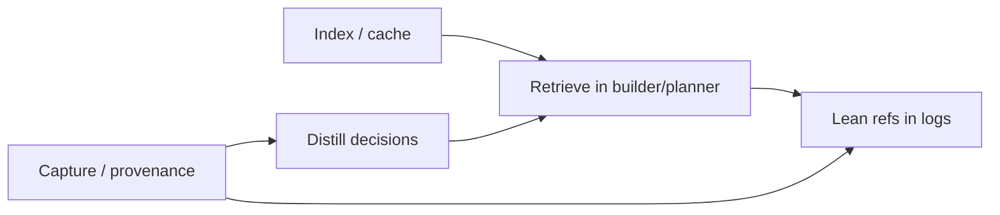

<!--
  STEWARDSHIP — primary retrieval and RAG strategy note. See docs/VISION_DOCS.md.

  - Purpose: current source for what is retrieval-shaped, what is not RAG, and how retrieval plugs into context/storage.
  - Keep shipped reality separate from deferred corpus/federation ideas.
  - Source lineage: rag-gap-analysis.md.
-->

# Retrieval and RAG strategy

**Status:** Current retrieval/RAG strategy note — distilled from the Phase 5 planning-era RAG gap analysis.  
**Related anchors:** [context-storage-and-observability.md](./context-storage-and-observability.md), BL-002, BL-348..BL-357.

---

## Purpose

This note explains where retrieval belongs in mcp-coder:

- what is genuinely **RAG-shaped**,
- what should be solved with storage, observability, exact indexes, or compiler policy instead,
- which corpora matter,
- how retrieval should feed the context builder,
- and which advanced retrieval ideas remain future direction.

The main boundary to preserve:

> Not every missing context problem is a RAG problem.

## Current position

The codebase already has the foundations that retrieval builds on:

| Layer | Current role |
|---|---|
| **Context compiler** | controls what goes into executor/helper context |
| **Workspace history / delegation storage** | records what happened and what changed |
| **Trace / observability stack** | records enough provenance to debug or later index |
| **RAG / search substrate** | supports retrieval over indexed records where already implemented |

Retrieval is a consumer of these layers, not a replacement for them.

## Litmus Test

Something is **RAG-shaped** only when all of these hold:

| Criterion | Meaning |
|---|---|
| **Corpus too big** | Cannot paste everything into one prompt every delegation |
| **Relevance varies** | The right slice changes per task/spec/chat |
| **Reusable** | Worth indexing once and querying many times |
| **Fuzzy match** | Need keyword/semantic match, not a single exact key |

If lookup is by exact key, use a DB/index query. If the problem is that mcp-coder never recorded the data, fix observability first. If the same facts are re-derived every run, build a cache or code-intel index before calling it RAG.

## What Is Not RAG

| Problem | Correct family | Why |
|---|---|---|
| Active epics/tasks | Direct read / search | Too small and structured; historical specs can enter delegation memory |
| Helper/builder input prompts | Trace/log capture | Recording problem first |
| Full executor prompt audit | Trace / prompt refs | Storage and provenance, not retrieval |
| Repo map / symbol outlines | Code-intel index | Deterministic structure |
| Recently touched files | Recency ranking | Time/order query |
| Spec contract paths | Spec parser + compiler | Exact contract |
| File payloads in prompt | Context tiers + budget | Compiler push; retrieval may add hints |

The recurring trap is: “we can’t see what the builder saw” feels like retrieval, but it is observability first.

## Retrieval Corpora

When non-RAG work is stripped away, the real retrieval surface is four corpora.

### 1. Workspace Source Files

| Field | Direction |
|---|---|
| **Question** | “What file relates to this task?” “Where is this concept implemented?” |
| **Unit** | file summary + symbol list + staleness hash |
| **Update** | on file change / snapshot / post-delegation hook |
| **Search** | FTS over summaries and symbols first; embeddings only if measured need appears |
| **Consumers** | picker, builder, planner, later executor-pull |

This is the highest-value file-recall corpus. Symbol search catches literal names; file summaries help when task language and code names differ.

### 2. Delegation Memory

| Field | Direction |
|---|---|
| **Question** | “What did we learn before?” “How did a similar task finish?” |
| **Unit** | delegation digests, outcomes, changed files, historical specs |
| **Update** | append on each delegation |
| **Search** | relevance over past delegations/specs |
| **Consumers** | planner and builder |

The key improvement over recency is cross-spec relevance. A fact learned in one spec should be available to a later related spec when the module/topic overlaps.

### 3. Distilled Session / Chat Decisions

| Field | Direction |
|---|---|
| **Question** | “What did we decide in the host chat?” |
| **Unit** | curated decision digests, not raw transcript chunks |
| **Update** | session end, successful delegation, or explicit digest action |
| **Search** | FTS / semantic over accepted decisions |
| **Consumers** | planner, spec validation, builder |

Raw chat RAG is intentionally rejected: it mixes accepted plans, rejected ideas, mistakes, and conversational noise. Distillation needs provenance and outcome labels.

Near-term bridge: bounded hot transcript windows can be injected directly without making them a RAG corpus.

### 4. External Knowledge / Worked Patterns

| Field | Direction |
|---|---|
| **Question** | “How did we solve this kind of library/framework issue before?” |
| **Unit** | curated skills, fetched docs, localized worked patterns |
| **Update** | manual or outcome-gated post-run promotion |
| **Search** | explicit topic query |
| **Consumers** | planner and builder when invoked |

The important rule is **outcome-gated localization**:

- do not index every web hit or blog post,
- do save patterns that actually helped,
- preserve source URL, stack tags, delegation reference, and outcome.

Cross-project/global RAG belongs here, but it should stay explicit so normal single-project retrieval does not become noisy.

## Dependency Order

| Stage | Delivers | Unblocks |
|---|---|---|
| **Capture** | source refs, trace bodies, line/byte provenance | honest distillation and replay |
| **Index** | file summaries, symbols, delegation search | workspace/delegation retrieval |
| **Distill** | accepted decision chunks | chat/session memory |
| **Retrieve** | builder/planner context refs | relevance over recency |
| **Lean logs** | `context_refs[]` instead of duplicating bodies | scalable audit |

Do not skip capture and indexing and jump directly to embeddings.

## Compile-Push vs Executor-Pull

| Mode | When | Current stance |
|---|---|---|
| **Compile-push** | before executor/backend run | primary path; builder/picker adds retrieved context |
| **Executor-pull** | during executor loop | future/harder path; requires clearer audit and tool control |

The recommended order remains: wire retrieval into the builder first, then revisit executor-pull once audit/tooling is strong enough.

## Observability Coupling

Retrieval references should be replayable. Indexed chunks should carry metadata like:

- `source_kind`
- `source_path` or `delegation_id`
- line or byte range
- `sha256`
- `indexed_at`
- optional outcome labels

Delegation logs should prefer `context_refs[]` over duplicating large retrieved bodies.

## Retention and Promotion

Different layers have different lifetimes:

| Layer | Retention bias |
|---|---|
| workspace file corpus | refresh/drop on file hash change |
| delegation memory | project-audit horizon, then distill important lessons |
| chat decision digests | medium/long depending on decision value |
| worked external patterns | long-term, outcome-gated |
| raw JSONL/traces | shorter forensic window once promoted refs exist |
| checkpoints/blobs | policy-driven; never silently destroy restorable value |

The long-term policy is **promote then prune**: preserve what mattered before compacting noisy raw history.

## FTS Before Embeddings

RAG means “retrieve relevant context,” not necessarily “use vectors.”

| Choice | Current stance |
|---|---|
| **FTS / keyword** | default first implementation; fast, local, cheap |
| **LLM-generated summaries + FTS** | high leverage because summaries contain natural language |
| **Embeddings** | measured upgrade only if FTS + summaries miss too often |

This avoids adding cost and re-indexing complexity before evidence says it is needed.

## Phase 5 Shape

The old source note captured Phase 5 planning. The current strategy keeps the same ordering:

| Step | Purpose |
|---|---|
| retrieval contract | one shape for `ContextRef` / `retrieve()` |
| delegation relevance | use existing delegation memory by relevance, not only recency |
| workspace-file corpus | summarize files + symbols |
| builder/picker integration | feed retrieval into compile-push path |
| measurement / lean refs | decide whether embeddings are needed; keep logs scalable |

The authoritative PM details remain in phase/backlog docs. This note preserves the architecture logic behind them.

## Deferred Direction

These remain future direction, not default current behavior:

- chat-session distillation into RAG,
- executor-pull retrieval,
- embeddings/vector store,
- cross-project/global RAG,
- curated web localization store,
- reasoning trace reuse,
- retention/GC automation.

## Legacy Source Note

This note replaces the active role of:

- [archive/rag-gap-analysis.md](./archive/rag-gap-analysis.md)

Keep the archived source for detailed Phase 5 planning tables, evidence rows, and historical wording.
